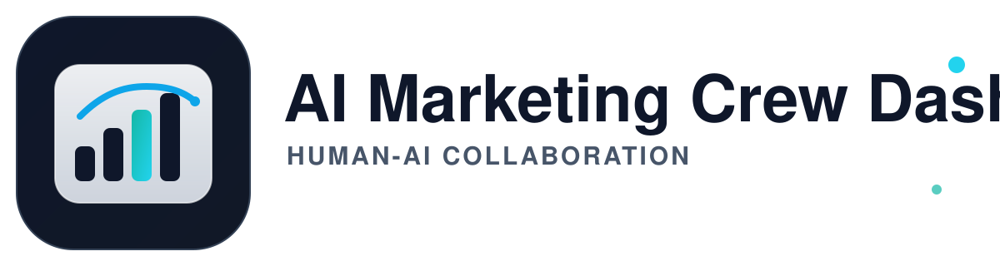

# AI Marketing Crew Dashboard

AI Marketing Crew Dashboard is the UI and governance layer for Human-AI collaboration. The platform focuses on Kanban execution, permission control, auditability, and agent lifecycle management.



## Brand Update

- Old display name: AMC Command Center
- New display name: AI Marketing Crew Dashboard
- Main brand logo: public/amc-dashboard-logo.svg
- Horizontal logo: public/amc-dashboard-logo-horizontal.svg

## Local Development

```bash
npm install
npm run dev
```

Open http://localhost:3000 in your browser.

## Tech Stack

- Next.js (App Router)
- TypeScript
- Tailwind CSS
- Prisma

## Key Paths

- App metadata and title: src/app/layout.tsx
- Main board header branding: src/components/KanbanBoard.tsx
- Brand logo asset: public/amc-dashboard-logo.svg
- Latest product PRD: PRD.md
- API service map: docs/API_SERVICES.md
- AMC Agent connectivity guide: docs/AGENT_CONNECTIVITY.md

## Notes

- Dify remains the workflow and knowledge-base center (Dify-first).
- AI Marketing Crew Dashboard focuses on UI, permission boundaries, integration, and observability.
