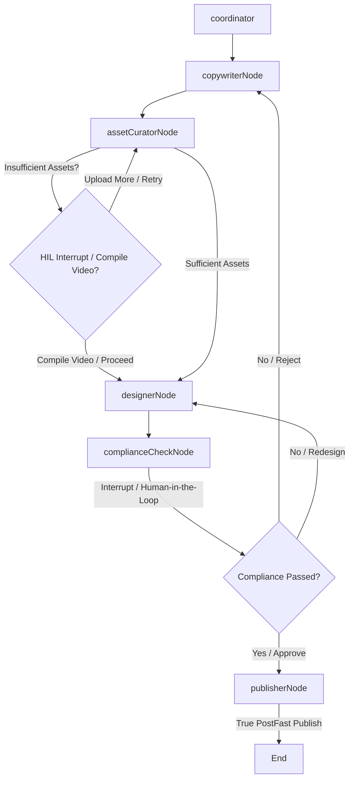

# AI Agent Marketing System Roadmap & Evolution Plan

This document details the selected features for the evolution of the multi-agent AI marketing system built with LangGraph.ts. Following the alignment on product requirements, the system will implement three key capabilities: **Semantic Asset Selection (Feature 1)**, **True Social Publishing (Feature 3)**, and **Analytics-Driven Copy Optimization (Feature 5)**.

---

## 1. Approved Features

### Feature 1: Semantic Asset Selection & Volume Optimization (Refactor `assetCuratorNode`)
* **Objective**: Instead of returning a single image, the curator agent selects a platform-appropriate number of images matching the task topic. If matching images are insufficient, it offers to compile them into a video or requests supplemental assets from the brand manager.
* **Platform Constraints**:
  * **Instagram / RED (小红书) / TikTok**: Target 3-9 images (minimum 3 images or 1 video).
  * **Google Business Profile**: Target 1-2 images (minimum 1 image).
  * **Others**: Target 1 image.
* **Asset Auto-Tagging Trigger & Industry-Adaptive Recognition**:
  * When a new media asset is confirmed via the upload API, it triggers a background process of the **Platform Designer**.
  * **Dynamic Industry Resolution**: The designer queries `AssignmentDecisionLog` and parses the brand name/description to infer the brand's industry (e.g., F&B, Pilates/Fitness, Home Renovation, Winery).
  * The designer downloads the image, sends it to Gemini Multimodal with an industry-specific tagging prompt, auto-analyzes the image content, generates highly relevant semantic tags (`aiTags`) and captions (`aiCaption`), removes the temporary `'待确认'` tag, and triggers a board update SSE event to live-refresh the UI. This prevents generating incorrect food-related tags on non-F&B brands.

### Feature 3: True Social Publishing (Refactor `publisherNode`)
* **Objective**: Transition the mockup publishing flow into actual API publishing through PostFast when the brand has configured credentials.
* **Mechanism**:
  * Check if the brand has `postfastApiKey` configured.
  * If configured, execute `postfastPublish` from the PostFast integration library, passing the platform, caption, media URLs, hashtags, and social account ID.
  * Store the actual `postId` return value and update the post status and URL in the database accordingly.
  * Fall back to the mockup publishing flow if `postfastApiKey` is not configured, ensuring testing/demo safety.

### Feature 5: Analytics-Driven Copy Optimization (Refactor `copywriterNode`)
* **Objective**: Close the loop by feeding historical post performance back to the copywriter agent to guide new post generation.
* **Mechanism**:
  * Fetch post performance metrics using `postfastGetAnalytics` if `postfastApiKey` is configured.
  * Sort posts by engagement metrics (impressions, likes) to identify the top 3 highest-performing posts.
  * If PostFast analytics are not available, fall back to retrieving the last 3-5 published content drafts for the brand to provide context.
  * **Industry-Adaptive Prompt & Fallbacks**: The copywriter detects the brand's industry using the same dynamic resolution mechanism. The Gemini prompt and rule-based fallback templates are adapted specifically to the brand's industry (e.g. using fitness/Pilates, renovation, or winery specific vocabulary and hashtags rather than hardcoding food-related copy for non-F&B brands).
  * Construct a detailed prompt for Gemini containing the brand description, target platform, task details, and the top-performing posts (with their metrics) as reference examples.
  * Request Gemini to generate a high-performing post caption.
  * Fall back to rule-based template generation if the Gemini API key is missing or the call fails.

---

## 2. Discarded Options (Not Implemented)
* **LLM-Based Compliance Audits**: Replaced by deterministic, low-overhead string/regex matching.
* **Smart Watermark Contrast Positioning**: Standardized positions (e.g. bottom-right) are sufficient.

---

## 3. Technical Integration Details

### Files to Modify:
* **[src/agents/nodes/copywriter.ts](file:///Users/alextian/Documents/Claude/Projects/AI%20Staff/amc-kanban/src/agents/nodes/copywriter.ts)**: Refactored to fetch analytics and call Gemini for copy generation.
* **[src/agents/nodes/assetCurator.ts](file:///Users/alextian/Documents/Claude/Projects/AI%20Staff/amc-kanban/src/agents/nodes/assetCurator.ts)**: Refactored to match media assets semantically using Gemini, support multiple images, slideshow video fallback, and HIL interrupts.
* **[src/agents/nodes/publisher.ts](file:///Users/alextian/Documents/Claude/Projects/AI%20Staff/amc-kanban/src/agents/nodes/publisher.ts)**: Refactored to call `postfastPublish`.
* **[src/lib/gemini.ts](file:///Users/alextian/Documents/Claude/Projects/AI%20Staff/amc-kanban/src/lib/gemini.ts)**: A clean utility wrapper to execute calls to the Gemini API.

---

## 4. AMC Crew Roles & Division of Labor (角色分配与工作分工)

Every user's basic AMC Crew contains both the **Platform Agent Crew** and the **User's own AMC Agent**:

### 4.1 Platform Agent Crew (平台内置 Agent 团队)
A specialized, system-level execution team that runs inside the platform's multi-agent workflow:
*   **Researcher (研究员)**: Responsible for searching, scraping, and processing all data-related tasks.
*   **Designer (设计师)**: Manages the brand's asset library, automatically applies tags (themes/categories), polishes assets, and compiles images into video formats (e.g. slideshows) to prepare media assets for content generation.
*   **Copywriter (文案师)**: Responsible for reviewing and polishing generated post copy to "humanize" it (remove AI-like tone), ensuring compliance checks, and optimizing copy to maximize conversion rates.

### 4.2 User's AMC Agent (用户专属业务代理)
A dedicated, long-running agent assigned specifically to the user's brand (e.g. registered via API key) that manages the outer lifecycle and client communications:
*   Responsible for all other business and operational tasks, including brand onboarding interviews, calendar planning, Kanban board lifecycle management (creating/claiming/updating card statuses), pushing material requests/alerts, and coordinating final publishing actions.

---

## 5. SOP & User Case Traceability Check (SOP 与用例对齐自检)

This role structure has been validated against [usercase.md](file:///Users/alextian/Documents/Claude/Projects/AI%20Staff/amc-kanban/docs/usercase.md) and the operational SOP:

1.  **Onboarding (UC-M1/UC-H1)**: Initiated and managed by the **User's AMC Agent** via chat surveys and OAuth connection cards.
2.  **Market Research & Reputation Scraping (UC-A1/UC-A4)**: Run in the background by the **Platform Researcher**, collecting ratings and keywords to guide next-week strategy.
3.  **Visual Asset Optimization (UC-M3)**: Handled by the **Platform Designer**, which counts platform requirements, autotags files, crops dynamically, and automates video/slideshow fallbacks.
4.  **Copywriting & Compliance (UC-A2/UC-H2)**: Handled by the **Platform Copywriter** to humanize writing, check ASAS guidelines, and optimize conversion via performance analytics.
5.  **Review Response & Crisis Handling (UC-A4/UC-A5/UC-H3)**: Bridge between the **Platform Researcher** (detecting reviews) and the **User's AMC Agent** (auto-replying to $\ge 4$-star reviews, generating HIL crisis cards for $\le 3$-star reviews).
6.  **Task Automation & Delivery (UC-A3)**: Coordinated by the **User's AMC Agent** to handle PostFast APIs, schedule/post immediately, and update Kanban card statuses.

