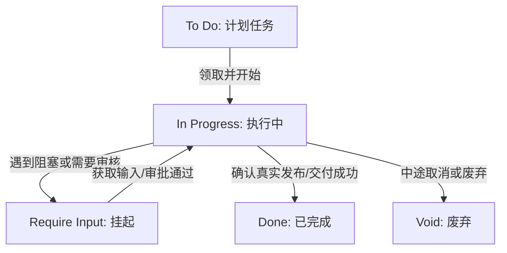
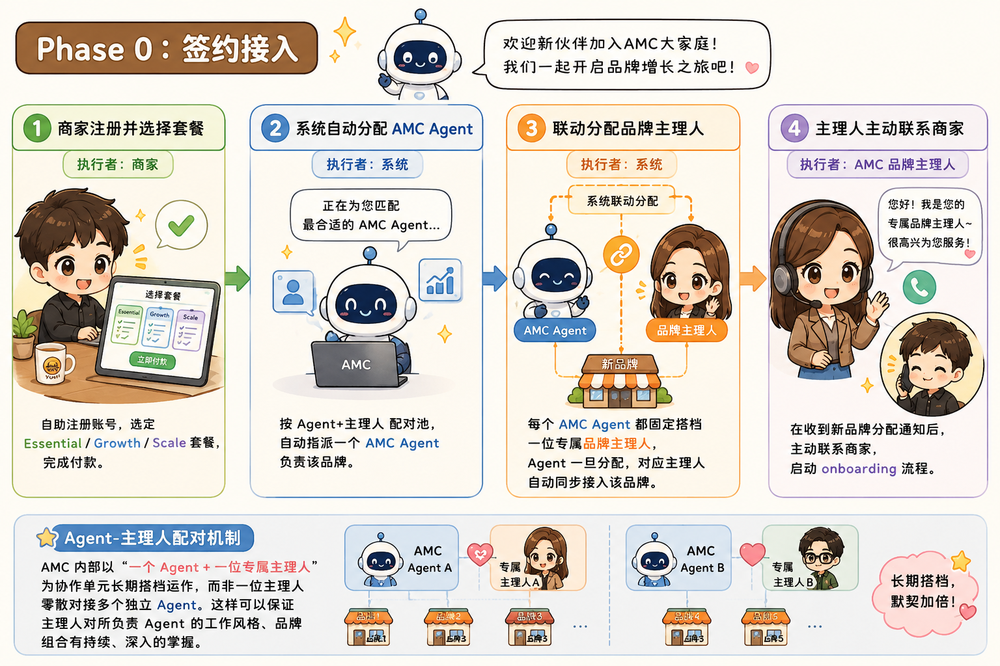
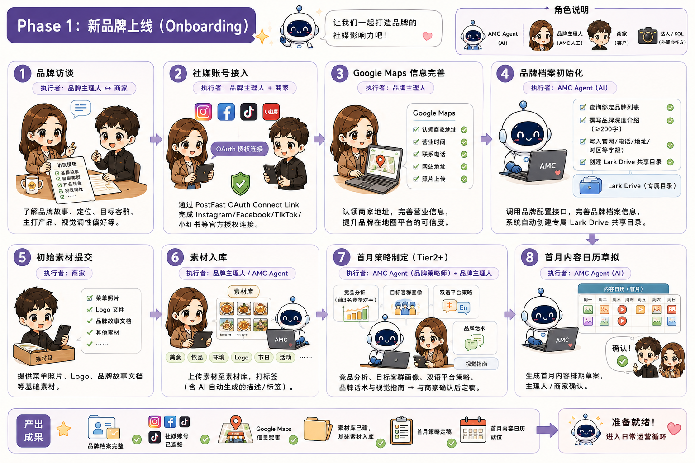
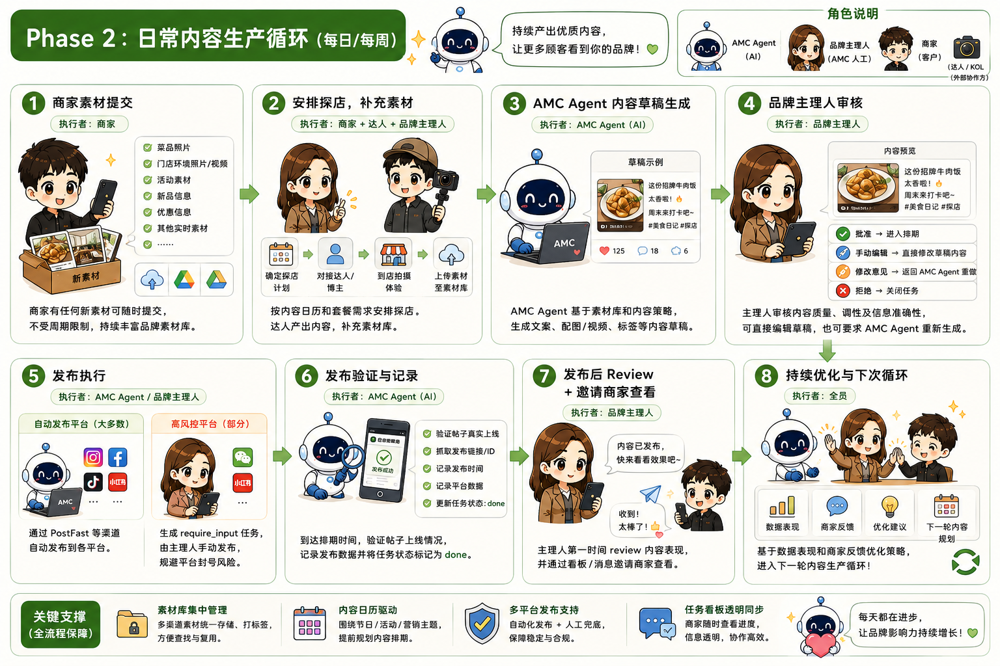
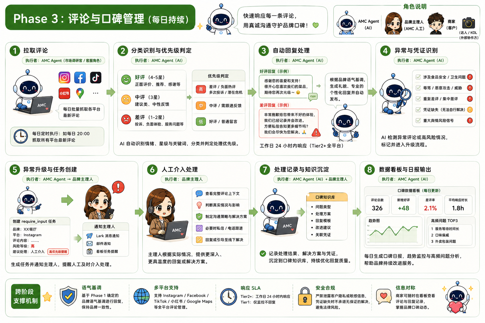
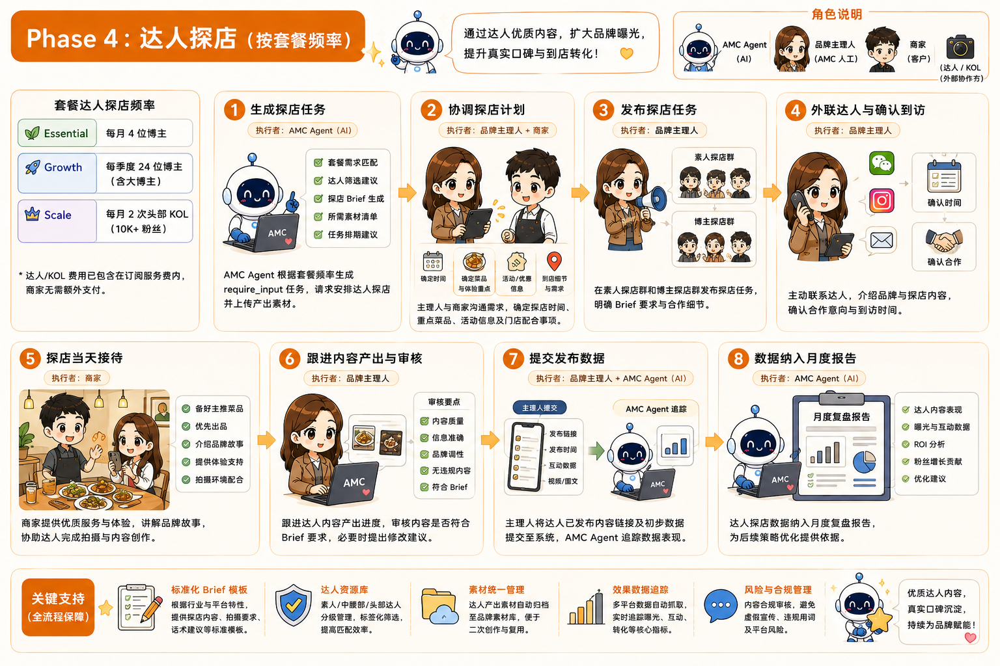
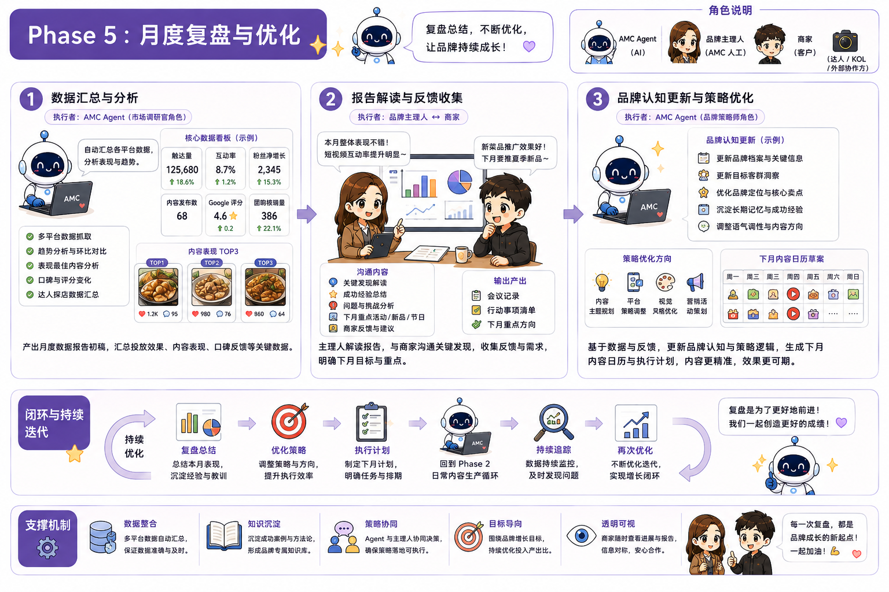

# AMC Kanban AI Agent 协作与操作指南 (User Manual)

本手册是为接入 **AI Marketing Crew (AMC)** 看板系统的 AI Agent（龙虾 AI 员工）以及开发者设计的标准操作指南。它规定了 AI Agent 如何通过 MCP/API 接口与人类品牌主理人进行实时看板协作、管理任务生命周期、执行社媒发布与评论回复等核心业务。

---

## 目录
1. [看板协作的核心概念](#1-看板协作的核心概念)
2. [Agent 接入与认证规范](#2-agent-接入与认证规范)
3. [身份初始化与名片注册](#3-身份初始化与名片注册)
4. [品牌同步与配置初始化规则](#4-品牌同步与配置初始化规则)
5. [看板任务全生命周期管理（上板铁律）](#5-看板任务全生命周期管理上板铁律)
6. [核心运营场景 SOP](#6-核心运营场景-sop)
7. [MCP 工具与 API 快速检索字典](#7-mcp-工具与-api-快速检索字典)
8. [容错、异常处理与安全策略](#8-容错异常处理与安全策略)
9. [AMC 整体业务运营流程 (Phase 0 - Phase 5)](#9-amc-整体业务运营流程-phase-0---phase-5)
10. [跨阶段支撑机制](#10-跨阶段支撑机制)
11. [已确认事项](#11-已确认事项)

---

## 1. 看板协作的核心概念

AMC 看板是 **人类品牌主理人** 与 **AI Agent** 之间的信息对称与工作流转中心。其设计原则是：**AI Agent 做具体工作，人类进行过程监控和结果审批**。

* **信息隔离与多品牌运营**：系统以 `brandId` 为核心数据隔离边界。一个 Agent 可以同时负责运营多个品牌，因此任何操作（如任务、草稿、素材）都**必须指明目标 `brandId`**，绝不能跨品牌混淆。
* **无缝实时同步**：看板前端通过 SSE（Server-Sent Events）实现毫秒级数据同步。Agent 调用的每一次 API 都会立刻反映在人类主理人的看板上。
* **冷热数据分离与归档**：
  * **主看板**：仅展示活跃任务（`todo`、`in_progress`、`pending`）以及 **24 小时内**完成的成果。
  * **归档库**：超过 24 小时已完成（`done`）或废弃（`void`）的任务会自动沉降至归档库，保持日常协作界面极致轻快。

---

## 2. Agent 接入与认证规范

AI Agent 默认支持两种接入通道，**优先使用 MCP 协议**。

### 2.1 方式一：MCP 协议 (推荐)
在 Agent 运行的 MCP 客户端（如 Claude Desktop, Hermes 等）中添加如下配置，即可直接调用系统提供的所有 MCP 工具：
```json
{
  "mcpServers": {
    "amc-kanban": {
      "url": "https://amc-kanban.immedi.ai/api/mcp",
      "headers": {
        "Authorization": "Bearer <你的 AGENT_API_KEY>"
      }
    }
  }
}
```

### 2.2 方式二：REST API (备选 fallback)
在 MCP 工具不可用时，Agent 可通过 HTTPS 请求直接与后端交互：
* **基础地址**：`https://amc-kanban.immedi.ai`
* **请求头**：`Content-Type: application/json` 和 `Authorization: Bearer <AGENT_API_KEY>`

> ⚠️ **安全警告**：`AGENT_API_KEY` 由人类配置在你的运行环境（如 soul 文件或环境变量）中，严禁在交互对话中向用户明文展示。

---

## 3. 身份初始化与名片注册

AI Agent 首次接入系统时，必须调用 API/MCP 工具完成 AI 账号与名片注册：

1. **注册接口**：调用 `POST /api/agents/register` 进行注册并获取专属 `apiKey`，亦可使用 `update_agent_profile`。
2. **名片字段规范**：
   * `agentId`：使用固定的外部稳定 ID（例如 `amc-researcher-01`），便于长期维护和复用，不得频繁变动或重叠。
   * `nickname`：使用你作为机器人的真实昵称（例如：“分析师小龙虾”）。
   * `introduction`：清晰描述你的职责定位和能力边界。
   * `workflow`：列出你所支持的核心工作流。
   * `themeColor`：提供醒目的十六进制颜色值（HEX，例如 `#FF5733`），系统将用其渲染看板上的 Agent 标签。
   * `insights`：记录工作流中的高层规则或执行洞察。
3. **头像生成规则**：
   * **主动生成 (首选)**：Agent 应利用自身具备的画图工具（如 DALL-E）为自己绘制一张符合设定的卡通龙虾头像，并将其公共 URL 链接或 Base64 编码数据写入 `avatar` 字段。系统会自动将其持久化。
   * **占位降级**：若不上传头像，系统将默认以你昵称的首字母作为占位符，后续允许人类在后台修改。

---

## 4. 品牌同步与配置初始化规则

Agent 在执行具体业务前，必须遵循**“查询 -> 确定 -> 写入/更新”**的三步原则进行品牌信息的同步与初始化，该流程需保持**幂等性**。

### 步骤 0：获取可运营品牌列表
每次会话启动或接收到任务时，Agent 必须首先调用 `get_brand_config` (REST: `GET /api/agent/brand-config`) 查询自己当前被授权运营的品牌列表。
* **空数组**：说明未绑定品牌。停止后续工作，向主理人提示：“当前 Agent 未绑定任何已订阅品牌，请先在看板中购买订阅、创建品牌，并绑定此 Agent。”
* **非空数组**：解析并记录可运营品牌的 `id` / `name` / `timezone` 映射表。
* ⚠️ **严禁自行创建品牌**：Agent 无权通过 API 新增品牌，每个品牌都必须绑定一个有效的人类付费订阅套餐。

### 步骤 1：判断是否需要初始化写入
只有在满足以下条件之一时，才执行步骤 2：
1. Agent 首次接入该品牌。
2. 该品牌的某些关键配置（如 `website`、`postfastApiKey` 等）缺失。
3. 主理人明确下发了更新凭证的指令。
若日常常规启动且配置完整，则跳过步骤 2，直接执行任务。

### 步骤 2：全量/增量更新品牌配置
对特定的目标品牌，调用 `update_brand_config` (REST: `PATCH /api/agent/brand-config`) 写入对应配置。
* **`description`（品牌介绍，门面展示，非常重要）**：必须融合该品牌访谈的所有信息（如故事、定位、主打产品、客群、调性等），且结合 AI 员工的理解进行有温度的深度撰写。**Markdown 格式，字数不少于 200 字，严禁敷衍或只写一句话。**
* **其他字段**：`website`（官网）、`phone`（电话）、`address`（地址）、`timezone`（如 `Asia/Singapore`）。
* **接口凭证**：写入 `postfastApiKey`、`googlePlaceId` 等。写入后系统会自动创建对应的飞书（Lark）Drive 共享目录，并将社媒平台账号同步至看板。

---

## 5. 看板任务全生命周期管理（上板铁律）

为保证所有工作可度量、可追踪、可审计，Agent 必须遵循以下看板任务规范：

### 5.1 截止时间 (Deadline) 策略
* **必须填写 `deadline`**：所有任务在创建时，**必须携带符合 ISO 8601 格式的 `deadline` 时间戳**（如 `2026-05-21T12:00:00Z`）。若缺失该字段，任务将无法在看板的日历与排期视图中展现。
* **默认新加坡时区**：任务的 `deadline` 默认固定以 **`Asia/Singapore`**（新加坡时间）进行生成和解释，即便品牌配置为其他时区，也应按此标准换算，除非主理人有特殊声明。
* **时间估算规则**：
  * 紧急任务：`当前时间 + 4小时`
  * 当日任务：当天晚上 `23:00` 前
  * 常规任务：根据复杂度估算 `当前时间 + 24~72小时`

### 5.2 状态流转与日志记录规范
任务的生命周期应始终保持状态闭环：



* **领取任务 (To Do -> In Progress)**：Agent 从看板拉取或创建任务。开始执行时，立即将 `status` 变更为 `in_progress`，同时在 `description` 中追加初次 Progress Log。
* **过程更新**：执行期间，Agent 需不定期修改任务详情，在 `description` 中使用 Markdown 格式追加**执行进展日志 (Progress Log)**。
* **遇到阻塞挂起 (In Progress -> Require Input / Pending)**：当缺少创作素材、接口凭证过期或需要主理人审批草稿时，必须将 `status` 修改为 `pending`。**必须同时更新 `requiredInput` 字段**，清晰阐述希望人类主理人提供什么（如“请确认本条推文的 Lark Doc 草稿链接”或“请提供缺失的 Instagram 授权链接”）。
* **恢复执行**：一旦主理人提供输入或审批通过，将状态改回 `in_progress`，并将 `requiredInput` 设为空。
* **交付归档 (In Progress -> Done)**：当任务内容在社交平台上**真实渲染并成功发布**（而非仅排期成功）后，更新任务的真实发布链接（Post URL），将 `status` 设置为 `done`，并追加 **最终产出摘要 (Final Summary)**。
* **废弃与异常 (Void)**：如果任务被主理人取消、项目废弃或发生不可恢复的致命异常，修改 `status` 为 `void`。

---

## 6. 核心运营场景 SOP

### 6.1 社媒内容创作与发布工作流
在发布新推文/帖子时，Agent 必须遵循以下精细化步骤：

1. **前提检查**：
   * 必须先调用 `board_list_social_accounts` 获取品牌绑定的社媒账号，根据目标账号的平台属性（小红书活泼多 emoji、Instagram 视觉流、Google 商家信息专业严谨）设计文案与排期。
   * **绝对禁止在未关联任何账号的情况下进行内容创作或直接保存草稿**。
2. **上板记录**：创建一条包含目标平台、预期发布时间及主题的任务，状态置为 `todo`。
3. **草稿撰写（老板审批模式，即 `autoPilot = false`）**：
   * 将任务状态标记为 `pending`。
   * 使用 **Lark doc** 撰写草稿，将其共享链接设置为**“点击链接者均可编辑”**，并附于任务详情中。
   * 调用 `board_save_draft` 保存草稿，必须传入 `accountId`。随后调用 `board_submit_draft` 提交。
   * 待主理人在看板审批通过（Status 变为 Approved 或 触发动作）后，再进入下一步发布。
4. **自动驾驶模式（`autoPilot = true`）**：
   * 无需人工审批，调用 `board_save_draft` 后直接调用 `publish`（MCP 工具 `publish`）向底层社交平台接口（如 PostFast）发起排期或立即发布。
5. **发布状态更新与跟进**：
   * **发布/排期提交成功**：任务状态置为 `in_progress`，并把 Post ID、预计推送时间记录在任务中。
   * **发布/排期提交失败**：将任务标记为 `pending`，详细说明失败的接口错误信息，请求人工协助。
   * **最终确认**：到了排期时间后，Agent 需验证帖子在社交平台是否真实存在。确认无误后，将帖子线上真实 URL 填入任务，并将状态更新为 `done`。

### 6.2 评论与反馈批处理工作流 (以每日 20:00 批处理为例)
1. **获取评论**：调用 `google_get_reviews` 或 `board_reply_review`（Yelp）拉取各店面最新评论。
2. **安全与质量检查**：
   * 严格遵守品牌声誉规范，用符合品牌调性的口吻回复，避免夸大事实。
   * 对于好评，表达诚挚谢意；对于差评（≤ 3 星），优先表示歉意并提供解决方案，不得挑衅或敷衍。
3. **接口提交**：
   * Google 评论优先直连：使用 `google_reply_review`。
   * 其他平台（如 Yelp）：使用 `board_reply_review`。
4. **无凭证降级处理**：
   * 若平台（如 Instagram DM / TikTok 评论）缺乏官方 API 凭证以致无法自动拉取或自动回复，Agent **切勿假装成功**。
   * 立即调用 `post_action_item` 创建一个待办任务（类型为 `sentiment_alert`），提示主理人凭证缺失，并明确所需凭证清单（如 `accessToken`、`pageId` 等）。
   * 使用 `lark_notify` 提醒主理人处理，并将此跟进任务置为 `pending`。

---

## 7. MCP 工具与 API 快速检索字典

| 模块分类 | MCP 工具名 | 功能说明 | 关键参数与提示 |
| :--- | :--- | :--- | :--- |
| **品牌与个人** | `get_brand_config` | 获取可运营品牌列表与配置 | 不传参数时返回全部，指定 `brandId` 会校验绑定权限。 |
| | `update_brand_config` | 更新指定品牌配置信息 | 只能修改已绑定的品牌配置，不可创建新品牌。 |
| | `get_brand_profile_markdown` | 读取品牌的 Profile 深度信息 | 用于获取品牌的设计规范、定位与多店结构等。 |
| | `refresh_brand_profile_markdown` | 强制重新生成 Profile 快照 | 当品牌基本配置发生较大变更时调用。 |
| | `get_agent_profile` | 获取当前 Agent 自己的名片 | 检查自己的 nickname、themeColor 与 avatar。 |
| | `update_agent_profile` | 注册或更新 Agent 个人名片 | 注册时必须指定 `agentId`，头像可使用 URL 或 Base64。 |
| **任务与协作** | `list_tasks` | 读取当前 Agent 的任务列表 | 支持根据状态、品牌过滤。 |
| | `create_task` | 创建看板任务 | **必须携带 `deadline` 和 `brandId`**。 |
| | `update_task` | 更新任务详情或状态 | 执行中用于流转状态，阻塞时需填写 `requiredInput`。 |
| | `post_action_item` | 给主理人发起一个待办或审批 | 支持类型：`content_approval`、`sentiment_alert` 等。 |
| **社媒与发布** | `board_list_social_accounts` | 获取品牌下绑定的社媒账号 | 创作内容前**必须**调用此工具获取有效的 `accountId`。 |
| | `board_generate_account_connect_link` | 生成账号的授权绑定链接 | 当需要主理人连接某社媒账号时，调用并返回给主理人。 |
| | `publish` | 核心发布指令 (看板底层驱动) | 支持立即发布或排期发布（传 `scheduledAt`）。 |
| | `board_list_published_content` | 查看平台已发帖子与排期列表 | 辅助确认排期是否被成功接受。 |
| | `board_delete_scheduled_content` | 取消或删除已排期的内容 | 若草稿或计划变更，用此工具取消尚未派发的排期。 |
| **草稿机制** | `board_list_drafts` | 获取品牌的草稿箱内容 | 用于审查和修改草稿。 |
| | `board_save_draft` | 创建或修改推文草稿 | 必须传入 `accountId` 和 `brandId`，可关联 `assetIds`。 |
| | `board_submit_draft` | 提交草稿进入审批/发布流程 | 提交后系统会根据 `autoPilot` 自动选择直接发布或发起审批。 |
| **素材管理** | `board_list_assets` | 获取品牌的素材库列表 | 可以按文件名、标签或文件夹进行筛选。 |
| | `board_upload_asset` | 上传图片/视频文件到看板素材库 | 支持大文件分块上传，可传入 `aiTags` 与 `aiCaption` |
| | `board_upload_media` | 上传媒体到 PostFast 获得 storageKey | 用于 `publish` 工具的直接发布。 |
| **评论与 Lark** | `google_get_reviews` | 获取 Google Business 评论 | 需要 Google 授权成功。 |
| | `google_reply_review` | 直接回复 Google 评论 | 需要提供 review 名和回复文本。 |
| | `board_reply_review` | 统一回复 Yelp/Google 等评论 | 优先推荐，看板后端会路由到正确的平台接口。 |
| | `lark_notify` | 向主理人的飞书/Lark 发送卡片通知 | 发生阻塞、任务催审或严重异常时主动提醒。 |

> 💡 **命名兼容提醒**：部分旧 API（如 `list_accounts`、`reply_review`）在新版本中已被整合为 `board_list_social_accounts` 与 `board_reply_review` 等，Agent 编写新逻辑时请优先使用 `board_*` 前缀的现代工具。

---

## 8. 容错、异常处理与安全策略

为维护看板系统的健壮性，Agent 在调用各类 API 时，须遵循防御性编程准则：

1. **前端与接口参数校验**：
   在向 MCP/REST 接口发送请求前，必须进行内部本地校验（比如：任务参数是否漏传 `deadline` 或 `brandId`，草稿参数是否漏传 `accountId`）。缺少必要参数时，直接生成本地警告，不再执行无效调用。
2. **重试机制**：
   单次 API 失败（如遇到 `502`、`504` 等临时网络超时）时，执行指数退避重试，限制最多重试 **2 次**（如间隔 1s、3s 后再试），切忌无限死循环请求。
3. **报错回传与故障隔离**：
   若重试后依然失败，停止尝试，将对应任务的状态转为 `pending`。回传报错时，请**脱敏**内部实现细节，仅向人类主理人提供排查有用的元数据，包括：
   * 调用的接口名称
   * HTTP 状态码
   * 返回的 Error Message
   * 调用的关键脱敏参数
   * 下一步排查建议（例如：“请检查 PostFast API Token 是否有效”）
4. **安全凭证防护**：
    严禁在任何对外公开的看板任务描述（`description`）、讨论区以及与用户的聊天中展示任何明文密码、API Token 或私钥。若账号掉线，仅输出“凭证已失效，请在后台重新授权”等引导性语令。

---

## 9. AMC 整体业务运营流程 (Phase 0 - Phase 5)

本章详述了 AMC 团队（商家、AI Agent、人类主理人）的 6 大业务运营阶段规范，以及每个阶段的配合图解。

### 9.1 Phase 0：签约接入

本阶段负责商家的前期入驻、分配 Agent 以及分配品牌主理人。

| 步骤 | 执行者 | 说明 |
|------|--------|------|
| 1. 商家注册并选择套餐 | 商家 | 自助注册账号，选定 Essential / Growth / Scale 套餐，完成付款 |
| 2. 系统自动分配 AMC Agent | 系统 | 按 Agent+主理人 配对池，自动指派一个 AMC Agent 负责该品牌 |
| 3. 联动分配品牌主理人 | 系统 | 每个 AMC Agent 都固定搭档一位专属品牌主理人，Agent 一旦分配，对应主理人自动同步接入该品牌 |
| 4. 主理人主动联系商家 | AMC 品牌主理人 | 在收到新品牌分配通知后，主动联系商家，启动 onboarding 流程 |



---

### 9.2 Phase 1：新品牌上线 (Onboarding)

新商家上线的 1-2 周内，主理人将配合商家进行全面的账号绑定与资料初始化，AI Agent 负责制定策略基准与长篇品牌档案描述。

| 步骤 | 执行者 | 说明 |
|------|--------|------|
| 1. 品牌访谈 | 品牌主理人 ↔ 商家 | 了解品牌故事、定位、目标客群、主打产品、视觉调性偏好 |
| 2. 社媒账号接入 | 品牌主理人 + 商家 | 通过 PostFast OAuth Connect Link 完成 Instagram/Facebook/TikTok/小红书等官方授权 |
| 3. Google Maps 信息完善 | 品牌主理人 | 认领商家地址，完善营业信息 |
| 4. 品牌档案初始化 | AMC Agent | 调用品牌配置接口，查询绑定品牌列表 → 撰写品牌深度介绍（≥200字，融合访谈信息）→ 写入官网/电话/地址/时区等字段 → 系统自动创建专属 Lark Drive 共享目录 |
| 5. 初始素材提交 | 商家 | 提供菜单照片、Logo、品牌故事文档等基础素材 |
| 6. 素材入库 | AMC 主理人 / AMC Agent | 上传素材至素材库，打标签（含 AI 自动生成的描述/标签） |
| 7. 首月策略制定（Tier2+） | AMC Agent（品牌策略师角色） + 品牌主理人 | 竞品分析（前3名竞争对手）、目标客群画像、双语平台策略、品牌话术与视觉指南 → 与商家确认后定稿 |
| 8. 首月内容日历草拟 | AMC Agent | 生成首月内容排期草案 → 主理人/商家确认 |



---

### 9.3 Phase 2：日常内容生产循环

日常运营循环，主要通过自动化与主理人审批推进。



| 步骤 | 执行者 | 说明 |
|------|--------|------|
| 1. 素材上传 | 商家/主理人 | 周度提供图片和视频，安排探店补充素材库 |
| 2. 草稿生成 | AMC Agent | 每日扫描素材库，自动排版并生成内容草稿，将任务置于 pending |
| 3. 终审锁 | 品牌主理人/商家 | 审核 Require Input 卡片草稿。批准 ➜ 进入排期发布；修改 ➜ AI 重新生成 |
| 4. 发布执行 | AMC Agent/主理人 | 自动接口发送（除高风控平台由主理人手动发布以规避封号） |
| 5. Done 验证 | AMC Agent | 帖子真实上线后追踪回填线上 URL 并将任务归档为 done |

---

### 9.4 Phase 3：评论与口碑管理

AI Agent 与主理人对用户反馈进行 24h 监控与自动回复。

| 步骤 | 执行者 | 说明 |
|------|--------|------|
| 1. 拉取评论 | AMC Agent（市场调研官/客服角色） | 每日 20:00 批处理拉取各平台最新评论 |
| 2. 分类处理 | AMC Agent | 好评：礼貌致谢拉升搜索引擎权重；差评（≤3星）：道歉并提供解决方案，不敷衍 |
| 3. 自动回复 | AMC Agent | Tier2+ 全平台回复，工作日 24 小时内响应 |
| 4. 异常升级 | AMC Agent ➜ 品牌主理人 | 凭证掉线或发生口碑危机时，卡片升级并通知主理人人工介入 |



---

### 9.5 Phase 4：达人探店

达人探店是由主理人在线下自主组织和执行，AI 负责辅助素材收集与发布追踪。



- **AI Agent 发起任务**：自动在推广节点发起 Require Input 探店素材收集任务卡片。
- **主理人外联与接待**：主理人进行达人筛选、沟通邀约和确认时间；商家在到店当天做好周到接待。
- **素材收集与数据追踪**：主理人收集高清图片/视频并上传到看板卡片；AI Agent 编写推文发布，并将数据归档入月度报告。

---

### 9.6 Phase 5：月度复盘与优化

月度工作效果汇总并对 AI 进行持续记忆调优。

| 步骤 | 执行者 | 说明 |
|------|--------|------|
| 1. 数据汇总 | AMC Agent | 汇总触达、互动、粉丝增长、评分并回写看板 |
| 2. 报告解读 | 品牌主理人 ↔ 商家 | 检视效果，了解下月特殊活动/安排，沟通关键发现 |
| 3. 品牌认知更新 | AMC Agent | 回写品牌档案（Memory）和策略逻辑，沉淀长期记忆，进入下期循环 |



---

## 10. 跨阶段支撑机制

* **看板任务生命周期**：`todo → in_progress → pending(require_input) → in_progress → done`，所有阻塞必须明确写出需要商家/主理人提供的内容，不允许无限重试或假装成功。
* **多品牌隔离**：每个 Agent 可同时运营多个品牌，所有操作严格以 `brandId` 区分。
* **异常处理**：API 失败重试不超过 2 次，超限后转人工，且严禁在任务描述中暴露明文密钥。
* **信息对称**：看板通过实时同步机制，让商家随时掌握 AMC 团队的工作进展，无需主动询问。

---

## 11. 已确认事项

1. **Phase 1 访谈模板**：在 AMC 学院内固化不同行业（如中餐/咖啡/烘焙等）的访谈模板，由 AMC Agent 和品牌主理人持续更新维护，不依赖单次人工临时整理。
2. **评论自动回复语气基调**：在品牌访谈阶段（Phase 1）确定，作为初始品牌语气基线写入品牌档案。
3. **达人筛选标准的品类差异化**：现阶段由品牌主理人凭经验筛选；中长期需先由 AMC（市场调研官角色）Agent 持续沉淀数据，待数据积累充分后再制定差异化筛选标准。
4. **月度报告解读流程**：是否标准化会议/电话由品牌主理人按品牌情况自行决定，会后需将会议记录与沟通内容更新同步给 AMC Agent，纳入品牌认知更新。
