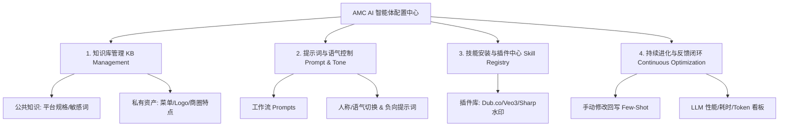
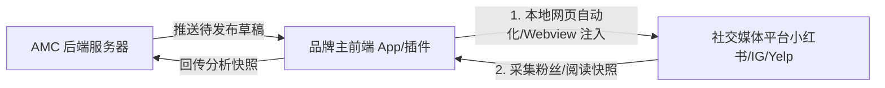

# AMC AI 智能体配置与持续优化控制台 (Agent Configuration & Optimization Console) 设计方案

在 AMC（AI Staff）平台中，要使 **AMC Copywriter** 和 **AMC Designer** 具备高度个性化、符合本地商圈诉求的营销能力，并能随着使用深入“越用越聪明”，**一个图形化的智能体配置页面（AIOps Console）是绝对必须的**。

### 👥 角色分工与权限边界 (Role & Permission Scopes)

在实际的商业运营中，**餐饮老板（品牌主）并不参与 AI 的底座配置与调优工作**。他们是 AI 生产力的消费者，核心关注内容排期和 ROI。因此，配置控制台是专门面向 **系统管理员 (Admin)** 和 **AMC 代运营主理人 (Coordinator)** 设计的，其角色分工如下：

*   **系统管理员 (Admin)**:
    *   **权限范围**：全局（All Tenants）。
    *   **核心职责**：管理底层的 API 密钥与第三方模型服务商（多大模型热插拔路由）；维护平台级全局知识库（敏感词、违禁词、各大平台字数字长限制规范）；设计和更新全局默认 Prompt 模板。
*   **AMC 主理人 (Coordinator / AMC Agent)**:
    *   **权限范围**：其代运营的多个用户品牌（Multi-brand Scope）。
    *   **核心职责**：在 Onboarding 阶段为托管品牌配置私有知识库（上传菜单、定位、Logo 边框等）；根据品牌调性调整语气偏好（选择第一人称/地道 Singlish）；按需为品牌“购买并安装”技能插件（如开启 Dub.co 追踪、Veo3 视频生成）；人工审核用户的修改反馈（User-Correction），批准高质量的 Few-Shot 对入库，避免“垃圾数据污染”。
*   **餐饮老板 / 品牌主 (Brand Owner / AMC MM)**:
    *   **权限范围**：无底层技术配置（AIOps）权限，但拥有**极富拟人化“AI 员工”感的服务与业务管理控制台**。
    *   **核心功能与职责**：
        *   **拟人化互动**：与拥有呼吸感和状态动画的 AI 虚拟助手交互，通过**对话式指令**生成图文草稿或获取运营分析。
        *   **轻量上下文维护**：允许手动或通过与 AMC MM 聊天的方式调整品牌 Profile 与上下文（如更新新菜品、修改营业时间）。
        *   **素材快捷上传**：一键唤起手机原生系统相册或相机，随时向 AI 投喂出餐照。
        *   **商业订阅与加购**：在前端购买/升级套餐，或单独加购 Veo3 视频生成包、Dub.co 短链域名包、AI 电话接听等增值服务。
        *   **内容与效果消费**：查看内容日历、审批/退回草稿、浏览直观的到店 ROI 报表。

---

## 🏗️ 控制台功能版块规划

智能体配置中心拟划分为 4 个核心版块：

---

## 1. 知识库管理 (Knowledge Base Console)
AI 生成的图文是否有“烟火气”和“餐厅专属感”，取决于知识库的丰富程度。

### A. 公共知识库 (Global Platform KB)
*   **平台规范**：各主流媒体（小红书、Instagram、TikTok、Google Business）最新的字数限制、图片尺寸规格、视频长短建议。
*   **出海餐饮常识**：中英文菜品翻译映射表、通用餐饮场景词汇。
*   **风味词汇与敏感词库**：Singlish 本地餐饮词汇，以及小红书/Instagram 的平台敏感词与违禁词。

### B. 私有品牌知识库 (Brand Private KB) - *由品牌主或主理人按需配置*
*   **品牌基础上下文**：主营菜系（如“川菜”）、客单价、目标受众（如“新加坡本地上班族”）。
*   **数字化菜单 (Digital Menu)**：菜品名称、风味描述、核心原材料、定价以及精美实拍图。
*   **视觉资产库 (Visual Assets)**：
    *   **品牌 Logo**：用于自动物理水印叠加。
    *   **品牌专属调色板**：主色调、辅助色，在自动排版生成海报时自动应用。
*   **历史爆款文案库**：录入或自动同步该品牌过去点击率、核销率最高的高转化帖子，作为 Few-Shot 检索源。

---

## 2. 提示词与语气管理 (Prompt & Voice Console)
让用户无需编写复杂的 Markdown 提示词，通过图形化开关直接改变 AI 的说话风格。

| 配置项 | UI 表现形式 | 底层 Prompt 逻辑映射 |
| :--- | :--- | :--- |
| **品牌人称视角 (Perspective)** | 下拉单选：`第一人称(我/我们)`、`第三人称(探店视角)`、`客观通告视角` | 动态将 `"You must write from a first-person perspective (I/We)..."` 或 `"You are a food influencer reviewing..."` 注入 System Prompt。 |
| **语言风格 (Style Tags)** | 标签多选：`热情洋溢`、`幽默风趣`、`精致高雅`、`地道 Singlish` | 自动往 Prompt 中追加对应的语气描述符和参考词汇（如勾选地道 Singlish 时，提示词中加入 `chope, shiok, lah` 等要求）。 |
| **避讳词汇 (Negative Prompts)** | 文本框（以逗号分隔） | 汇总后喂给 Compliance（合规）节点进行强约束拦截，例如：`禁止使用“最”、“第一”、“全网秒杀”等极端词汇`。 |
| **爆款 Hook 规则** | 模块开关：是否启用小红书爆款叹号排版/表情符 | 决定是否在双阶段生成的第一阶段（`generate-hook`）强制注入特定平台的版面格式。 |

---

## 3. 技能安装与插件中心 (Skill Registry & Plugin Store)
AMC 作为一个模块化平台，不同的品牌主可能有不同的分发渠道与营销策略。技能安装中心支持**一键启用/禁用**智能体的高级工具。

*   **智能短链追踪 (Dub.co Link Sync)**:
    *   *功能*：自动将文案中的预订长链接转为带品牌域名的短链，用于到店 ROI 审计。
    *   *配置*：开关，支持自定义域名绑定。
*   **AI 视频生图 (Veo3 Image-to-Video)**:
    *   *功能*：将 Designer 生成的底图异步转化为 TikTok 9:16 短视频。
    *   *配置*：开关，可配置视频时长（5s/10s）与背景音乐风格。
*   **海报物理水印渲染 (Sharp Canvas Renderer)**:
    *   *功能*：在 AI 配图上自动合成商家 Logo 和促销文字。
    *   *配置*：可拖拽的水印位置模板（如：左上角 Logo + 右下角 8 折促销标）。
*   **差评公关响应插件 (Review Auto-Responder)**:
    *   *功能*：监控 Google Maps / Yelp，当出现差评时自动生成回复。
    *   *配置*：评分阈值开关（如 $\le 3$ 星触发），自动回复风格（诚恳致歉型/澄清解释型）。

---

## 4. 自进化与持续提升闭环 (Continuous Evolution Loop)
这是 AI 持续提升文案与设计准确性的**核心机制**。

### A. 手动修改回写学习机制 (User-Correction Few-Shot Vectoring)
*   **痛点**：AI 生成的文案往往有“AI 感”，主理人每次都要手动微调（如修改菜品名或本地口语表达）。如果 AI 下次还犯同样的错，用户体验会极差。
*   **闭环方案**：
    1.  **修改追踪 (Track Changes)**：在 Draft 编辑页面，当用户对 AI Draft 进行手动编辑并发布时，系统通过 `diff` 算法计算出**修改比例**。
    2.  **自动存入向量库 (Auto-Vectorization)**：若修改比例在 **10% ~ 40%** 之间（说明 AI 生成的大体可用，但细节需要人工润色纠错），系统自动将 `[AI 原始生成稿 + 用户修改后发布稿]` 结对，通过 Embedding 存入该品牌的**私有 Few-Shot 数据库**。
    3.  **后续生成检索 (Future Few-Shot Retrieval)**：下次 Copywriter 生成同类菜品或主题时，系统在 RAG 检索阶段优先把这一对“纠错对比案例”作为 Context 传入，提示 AI：*“用户上次将 A 改为了 B，本次请直接生成符合 B 风格的内容”*。

### B. HIL (Human-in-the-Loop) 合规拦截日志
*   展示合规检查节点（Compliance Check）失败的记录，以及人工干预通过的案例，用于调优合规节点的判定阈值。

### C. 大模型成本与表现看板 (AIOps Analytics)
*   监控每个智能体节点（Researcher, Copywriter, Designer）所用大模型的**耗时、Token 消耗量与生成成功率**，便于管理员根据 ROI 进行动态大模型切换（如：文案师从 GPT-4o 切换到更便宜但文笔同样好的 DeepSeek-V3）。

---

## 5. 对比 Postiz-app 配置管理方案与 AMC 的差异化优势

在 AI 配置管理上，Postiz-app 并非面向 B2B 托管代运营的“最优解”。通过下表对比，可以看出 AMC 自研 AIOps 控制台在面向角色及系统管理上的差异化优势：

| 维度 | Postiz-app 方案 | AMC AI 配置中心方案 | 为什么 AMC 的方案对业务更优？ |
| :--- | :--- | :--- | :--- |
| **配置面向角色** | **系统开发者与自托管极客**。 AI 参数（如 API Key）和 Prompts 多以环境变量或代码硬编码，调整门槛极高。 | **Admin (系统管理员) + Coordinator (代运营主理人)**。 Admin 统一配置模型底座，主理人图形化配置具体品牌的私有知识与语气。 | 餐饮老板（品牌主）无需关心 AI 配置；由专业的主理人（Coordinator）进行一站式 Onboarding 与调优，商家零认知负担。 |
| **提示词控制** | **系统级硬编码**。 文案与图像生成的 Prompts 静态写死在后端代码中，用户无法自定义特定的品牌风格。 | **主理人图形化微调**。 提供开关式提示词工程与“避讳词汇”黑名单，主理人根据品牌定位随时微调。 | 不同餐饮品牌有不同调性，必须允许主理人在后台细粒度定制避讳词和语气，而不是在代码中全局写死。 |
| **知识库隔离** | **单租户模式**。 缺乏多品牌私有知识库的物理与逻辑隔离，不适合多商户代运营。 | **多租户严格隔离**。 品牌私有知识库（菜单、Logo、Few-Shot）按 `brandId` 隔离，AMC MM 和 Agent 分权可见。 | 代运营主理人负责多个品牌，必须确保各家的菜品数据和品牌资产绝对隔离，防止 AI 生成交叉污染。 |
| **技能/插件启用** | **代码集成 / MCP 协议**。 必须在代码或外部 Agent 侧手动注册和配置新工具。 | **图形化应用市场 (Skill Store)**。 主理人代表商家一键勾选激活特定技能，系统自动注入 API 客户端。 | 商业化代运营需要根据商家的服务套餐决定是否启用高级功能（如 Veo3 视频生成成本高，主理人可针对付费套餐一键开启）。 |
| **持续优化能力** | **无**。 每次 AI 生成都是独立单次调用，无法从历史的人工微调中自我学习。 | **主理人审核回写闭环**。 基于 Diff 算法捕获用户的微调，由主理人审核通过后，自动打包存入私有 Few-Shot 库。 | AI 生成很难一蹴而就。通过“用户/主理人手动改，AI 后续学习”机制，极大减少主理人的重复润色工作量。 |

**总结：** Postiz-app 的设计哲学是**“把 Postiz 作为底座，把 AI 智能体写在外部”**（如通过外部 MCP 客户端调用 Postiz 的发帖 API），这适合开发者极客折腾，但不符合 **AMC 代运营服务商（Coordinator）为餐饮商家（Brand Owner）提供开箱即用托管服务** 的闭环商业体验。AMC 通过 AIOps 控制台将“智能配置与模型路由”内聚在平台内，由 Admin 负责运维、Coordinator 负责运营调优、餐饮老板负责审批消费，实现了真正分层治理的商业闭环。

---

## 6. 端侧自动化与采集桥接设计 (Client-Side Automation & Data Collection Bridge)

针对海外社交媒体平台（如 Instagram、小红书、Yelp）风控严厉、API 收费高昂或完全闭源的痛点，AMC 控制台增加了**端侧桥接智能体（Client-side Bridge Agent）**设计：

*   **实现原理**：通过在品牌主的桌面客户端（如 Chrome 插件）或移动端 App（内置 Webview 浏览器容器）中嵌入自动化发布与采集脚本，模拟真实人类操作。
*   **配置管理 (主理人视图)**：
    *   主理人在插件管理页面可勾选启用“端侧桥接发布”。
    *   实时监控品牌主端侧助手的在线状态（如：*“鼎泰丰小红书助手：已连接 / 上次快照同步：10分钟前”*）。
*   **账号快照采集（数据流）**：
    *   客户端助手在后台利用本地 Session 自动访问账号后台，截取粉丝量、近7日曝光量、最新差评与私信。
    *   数据脱敏后加密上报至 AMC 后端数据库，供 ROI 审计员与舆情监控模块直接读取。
*   **端侧全自动/半自动发帖（发布流）**：
    *   **半自动（手动复制）**：在 App 上点击“发帖”，文案和媒体素材自动载入剪贴板与临时相册，引导用户在官方便捷发布。
    *   **全自动（网页脚本注入）**：客户端以 Webview 沙箱方式打开小红书/Meta 创作者后台，注入脚本自动贴入标题、正文、图片，执行秒级自动点击发布，完全绕过官方 API 的重重阻碍。

---

## 7. 开源技术选型与二次开发建议 (Open-Source Repo Recommendations)

为加速 AMC 品牌主端应用与自动化桥接的开发，GitHub 上有多个极具参考价值的开源项目可用于二次开发或技术借鉴：

### A. 运营底座与多渠道排期调度 —— 首选 Postiz 或 Mixpost
*   **Postiz-app (`gitroomhq/postiz-app`)**：
    *   *技术栈*：Next.js + NestJS + PostgreSQL
    *   *利用价值*：作为后端“底座”极其合适。它内置了 25+ 社交媒体的 OAuth 认证、API 分发接口、统一内容日历（Calendar）和多租户 Workspace 管理。可以复用其发帖调度和媒体管理代码。
*   **Mixpost (`inovector/mixpost`)**：
    *   *技术栈*：Laravel (PHP) + Tailwind / React / Vue
    *   *利用价值*：如果需要构建独立的桌面代发软件，可以参考 Mixpost 的“跨平台多版面内容分发预览” UI 设计。它针对各个社交平台（如 IG、小红书等）不同规格的内容版本预览做得非常优秀。
*   **TryPost (`trypostit/trypost`)**：
    *   *技术栈*：Next.js + Svelte + MCP
    *   *利用价值*：专门针对 AI Agent 和 MCP（Model Context Protocol）集成的社交工具。如果 AMC 的 LangGraph 节点需要更标准化地与排期后台通讯，可以直接参考其 API 设计。

### B. 端侧数据采集与发布桥接 —— 浏览器插件与自动化框架
*   **EasySpider (`NaiboWang/EasySpider`)**：
    *   *技术栈*：Electron / Pyppeteer
    *   *利用价值*：一个优秀的开源可视化网页自动化（RPA）爬虫。其在客户端模拟用户操作（点击、录入、快照截取）的流程逻辑，是 AMC “端侧助手”在本地沙箱内免 API 采集粉丝快照与自动发帖的最直接参考方案。
*   **Chrome React Extension Boilerplate (`lxieyang/chrome-extension-boilerplate-react-vite`)**：
    *   *技术栈*：React + Vite + TypeScript (Chrome MV3)
    *   *利用价值*：最适合作为品牌主“端侧桥接助手”的二开模板。利用浏览器插件不仅可以直接共享老板浏览器中的小红书/Meta 登录 Session，还能在后台安全运行内容抓取和自动化发帖脚本，极大降低开发成本。
*   **Tauri (`tauri-apps/tauri`)**：
    *   *技术栈*：Rust + HTML/JS (轻量桌面壳)
    *   *利用价值*：如果需要向老板提供一个独立的“AMC 桌面版 App”，用 Tauri 封装 Web 页面，并在 Rust 侧集成系统相册调取与本地自动化发布最为轻量高效。

---

## 8. 品牌主端应用技术栈选型规划 (Brand Owner Client Tech Stack Plan)

针对餐饮老板移动化、轻量操作的习惯，以及后台“端侧发布与快照采集”的强诉求，我们推荐采用 **“响应式 Web Portal (PWA) + Chrome 浏览器自动化插件”** 的混合技术架构，这套架构能提供极高的开发效率（ROI）并完美绕过社交平台 API 的风控封锁。

### A. 前端交互层 (UI & Interaction Layer) —— 移动/桌面自适应 Web (PWA)
*   **核心框架**：**Next.js (React) / TypeScript**
    *   *理由*：与平台管理后台保持同构技术栈，最大程度共享数据模型（Prisma Types）、API 请求层以及 UI 组件。
*   **样式与动效**：**Tailwind CSS v4 + Framer Motion + Lottie-React**
    *   *理由*：利用 Framer Motion 和 Lottie 渲染“AI 员工伴侣”的微交互状态（如 Idle、Listening、Thinking、Success 动效）。使用 Tailwind v4 搭建符合 Indigo 调性的现代磨砂玻璃态（Glassmorphism）极简界面。
*   **跨端运行环境**：**PWA (Progressive Web App)**
    *   *理由*：餐饮老板 90% 的时间在后厨或移动场景中。PWA 允许用户在手机浏览器中“添加到主屏幕”作为独立 App 使用，拥有原生的沉浸感体验。它还支持 **Web Push Notifications**，能够在遇到 Google Maps 紧急差评或待审批日历内容时，向老板推送即时系统预警。
    *   *系统相册唤起*：采用标准 HTML5 的 `<input type="file" accept="image/*" capture="environment">` 标签，即可在手机上直接拉起原生相机拍照，或者直接访问系统相册选择多张食物图进行投喂。

### B. 端侧自动化桥接层 (Client-Side Automation Layer) —— Chrome Extension
*   **核心框架**：**Chrome Extension MV3 + React + Vite + WebSocket**
    *   *理由*：
        1.  **共享 Session 权限**：插件直接运行在商家的台式机（前台收银机或办公室电脑）浏览器上，完美共享老板已登录的小红书、Meta 创作者后台、Yelp 的活动 Session。
        2.  **Web 自动化能力**：在 Background Service Worker 中使用 WebSocket 与后端长连接，监听来自平台的发布指令，并在网页端注入 Content Scripts 完成自动抓取快照与模拟人工点击自动发帖（无需购买昂贵且常风控的平台企业级发布 API）。
        3.  **开发效率**：可使用 `lxieyang/chrome-extension-boilerplate-react-vite` 作为模板，通过 Vite 快速编译，直接复用 Web 端的 React 逻辑组件。

### C. 移动混合包装层 (Alternative - Native Mobile Wrapper) —— Capacitor (可选加码)
*   **核心框架**：**Capacitor (by Ionic)**
    *   *理由*：如果未来商业化推广需要上架 Apple App Store / Google Play 商店，可以使用 Capacitor 将上述 PWA 页面直接打包为原生 Android/iOS 应用。它提供 `@capacitor/camera` 和 `@capacitor/push-notifications` 插件，提供 100% 物理级硬件访问。

---

## 📅 下一步集成计划 (Next Steps)

1.  **PRD 与 Schema 扩展**：
    *   将上述配置页面的数据实体（如 `BrandKnowledge`、`AgentSkillRegistry`、`UserCorrectionFeedback`）写入数据库设计中。
2.  **UI/UX 页面设计**：
    *   在管理后台新增 “AI 智能体配置中心 (AI Config Console)” 菜单。
    *   利用 **Stitch** 设计简洁直观的配置表单、技能开关按钮、以及 Feedback 向量对的管理页面。
3.  **RAG 节点集成**：
    *   在 `src/agents/nodes/copywriter.ts` 中，增加动态读取上述配置并进行 Few-Shot 拼接的逻辑。
