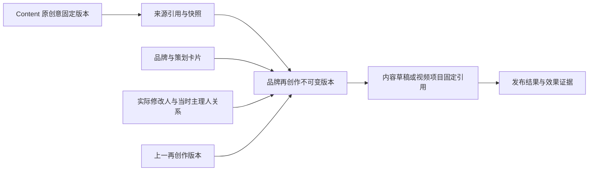

# AMCMM 创意再创作与 AI Native 升级设计

日期：2026-09-30。状态：P0 人工保存与追溯已部署，生产隔离回滚验证通过；User AI 持久工作台已部署并通过创意实模验收；完整制作运营及平台协作尚未交付，执行契约见 [IAIC 改造实施设计](amcmm-iaic-implementation.md)。面向 AMC 产品、AMCMM、Kanban、Growth、Content 和 IAiC Core 开发者。

AMCMM AI Native 的主要业务目标是：根据当前品牌资料主动从 AMC Content 原创意库匹配创意 → 用户 review 并修改 → 保存品牌再创作版本 → 添加素材进入既有制作流程，或保留在该品牌发布计划供日后使用。品牌简报是辅助能力，不能代替这条流程。

本次新增流程状态：2026-09-30 已部署；真实 Content 创意库、真实模型、审阅保存及计划回读验收通过；制作交接通过真实组件/模拟 API 验证，未执行真实付费生成或公开发布。首页和 Brand Ideas 预览不新建 AI 任务；用户主动展开任务面板时接受一次有界推荐任务，同一用户/品牌/UTC 日/品牌事实快照复用任务；明确刷新可启动新任务。后台 Runtime 在关页后继续，缺少事实进入同一任务的资料等待。只接受 Content 返回的持久原创意 ID，保留检索快照与摘要；无匹配如实展示，不伪造来源。

工作台设定统一放在系统设置中。初始值自动来自当前品牌资料，已保存的个人设定优先；可恢复品牌默认，切换品牌独立加载。无需填写设定即可进入推荐流程。

选中策划脚本后由 AMC-MM User AI Assistant 自动按当前品牌资料生成完整适配稿（有产品目录时结合真实 SKU，无目录时生成品牌通用稿），主理人审阅的是适配稿，原稿仅折叠作为来源。人工保存后，任务刷新及制作入口均使用已保存的业务版本；从素材入口选择脚本会保留已选素材。

用户可编辑推荐标题、策划、文案、素材要求，选择计划日期和平台。采用动作在单个事务内保存原创意快照、AI 候选证据、人工修改版本、品牌和实际操作者/当时主理人关系，并权威回读；跨月重试不能重复插入。同一推荐只能首次采用一次，之后使用既有版本编辑。两种去向都先保存审阅版本：“保留发布计划”保持待用状态；“添加素材制作”把已保存创意交接给既有图文/视频制作入口。制作、付费确认、批准及正式发布仍各自遵守现有流程。

验收必须覆盖来源伪造拒绝、无匹配、品牌资料过期、并发与回执丢失、日期/平台校验、当前授权、计划回读、跨刷新采用回执、制作入口绑定同一创意及手机端可用性。后台每日检索按品牌时区独立执行并自动保存待审策划；付费制作与正式发布仍需要既有审核流程。

本文保留整体目标设计；P0 当前执行契约和验证状态见 [创意版本追溯](creative-lineage.md)。P0 复用 BrandMarketingSolution 逐条保存版本，不新建四张业务表，也不在保存时同步下游或建立 outbox；审阅创意已交接既有制作入口，下游固定 creativeRevision 引用和无人值守制作发布仍待后续交付。本文后续能力以实施设计的状态表为准，设计本身不代表部署。

## 检查范围和证据

最初检查以用户说明的本地最新代码为基线，当时四个应用工作树均干净；后续实现与部署证据另见执行文档。尚未独立确认“MMO”的对应目录；按 AMCMM 检查 amc-mm，并补查与其集成的 Growth。没有将 Growth 宣称为 MMO。

| 代码库 | 检查基线 | 当前职责 |
| --- | --- | --- |
| amc-mm | 0576d69b2fbff48ce07fa1bd4e9cf72884049f16 | 品牌端 UI、伴侣、BFF、创意及制作入口 |
| amc-kanban | b408c34af6ae0092fa0d367c86bbd31b11c1edbd | 品牌访问、Crew、策划工作区、草稿、排期、发布与审计 |
| amc-growth | b692338345591325d96ce33c2bbca98845fe043e | 品牌研究、知识、增长策略及版本化报告 |
| amc-content | d6c427d18935f28a1df28ee848aa6084a6292e16 | 原创意库、内容生成、视频制作及来源资产 |

以下为最初设计的检查基线；P0 缺口已按 creative-lineage.md 修复并部署，AI Runtime 改造状态以执行设计为准。

1. **已有编辑保存功能。** MM `src/components/dashboard/CalendarSubPage.tsx` 的 `creativeFromForm` 和 `onSaveCreative` 支持标题、日期、平台、产品、策划、素材要求和文案标签。`BrandOwnerDashboard.tsx` 的 `handleSaveCalendarCreative` 调用 `save_workspace_patch / calendar_month`，提交整月数组。品牌策划公开分享页 `src/app/brand-strategy/[id]/page.tsx` 为展示页面，不应变为无登录编辑入口。
2. **已有快照，缺少逐条归属。** Kanban `src/lib/brand-plan/service.ts` 的 `saveWorkspacePatch` 保存 MANUAL_EDIT 的 CALENDAR 快照；`saveMarketingSolutionVersion` 查询最大版本再新增。`BrandMarketingSolution` 有 `createdById` 字段，但该保存函数不写入它；`src/app/api/brands/[id]/brand-plan/route.ts` 检查登录和品牌写权限后没有把可信 actor 传给服务。
3. **已有原创意关联。** `BrandPlanCalendarItem.inspirationCreativeId`、`inspirationCreativeLink.ts` 及生成时来源校验可复用。但 `calendarSync.ts` 的 `CalendarCreativeOption` 没有完整来源版本及修改人，普通编辑靠已有 JSON 合并保留字段，不能构成独立再创作记录。`agentNote` 中的 `brand-plan-calendar-item:` 是现有同步标记，不应承担正式外键。
4. **保存一致性有待加强。** 当前整月保存路径未见 expectedRevision；素材要求、草稿同步、计划版本和工作区更新分步调用，未见包住全部步骤的事务。静态判断存在并发覆盖和部分成功风险，尚未通过故障注入复现。MM 保存后的查询失败会用本地值回显，不足以证明权威回读通过。
5. **不是从零建设 AI。** MM 已有 companion 的 profile、skills、context、memory 等模块，部分记忆存于 localStorage。Content 有版本化创意与生成流程；Growth 有报告版本。四个应用根 package.json 未声明 `@immedi/iaic-core`，不能据此声称已集成独立 Core。

## 再创作的业务契约

用户明确要求：品牌主理人可以编辑并保存品牌策划创意草稿，保存内容必须记录再创作与品牌、主理人、原创意的关系。

当前业务责任划分：以 Kanban 为品牌再创作业务记录的权威系统，Content 保持原创意与其版本的权威系统，Growth 保持已发布品牌知识的权威系统。MM 不建立独立业务真值副本。创意借鉴关系不自动代表素材使用授权，也不自动产生报酬或所有权转移。

### 身份与权限

沿用现有 `AMC_PRINCIPAL` 平台能力角色、Crew `PRINCIPAL` 品牌关系和组织继承规则。品牌主 `OWNER` 与品牌主理人不混用。每次读写均通过当前品牌访问与编辑授权；全局角色本身不授予所有品牌访问。

服务端从会话或受信任委托解析实际操作者，不接受客户端提交作者、角色或品牌归属作为真值。保存 `actorUserId`、操作者当时有效角色及授权关系引用；另存品牌当时的主理人关系快照。管理员或 OWNER 编辑时记录本人，不冒充主理人。更换主理人后旧作品仍归当时修改人，当前访问权限按新关系执行。AI 辅助版本同时记录请求人、执行 Agent、taskId、候选工作区摘要与品牌事实摘要；当前采用由人类明确操作，未伪造持续执行 mandate。

### 数据关系

当前复用 BrandMarketingSolution 的 CREATIVE_ITEM 版本记录，不新建平行业务表：input 保存 origin、父版本、原来源快照、实际修改人、主理人关系与可选 AI provenance；output 保存创意快照，knowledge 当前卡片是最新投影。按品牌知识行锁分配逐条版本并在事务内写入审计。准确 Content 发行版本未知时只记录已有来源 ID/快照。

后续制作联动需在现有 Draft/VideoProject 上增加固定 creativeRevision 引用，并通过原作业幂等及权威回执验证；该关联尚未交付。

原创意版本和父再创作版本分别保存，不能用同一个 originalId 混合表达。首次人工修改基于原品牌策划卡片生成独立再创作记录；再次保存追加 revision，不覆盖原版。分叉或换来源显式创建新分支/来源引用，禁止在旧版本上偷偷换原创意。来源下架时保留合法审计引用并标明不可用；历史追溯不等于仍可把来源用于新生成。

跨服务不建立数据库外键，通过稳定 ID、版本、受权读取及内容摘要验证。Content 若当前无法返回不可变版本，先保存受权取得的原始响应快照和 hash，明确 `snapshot_only`，不伪造版本号。用户无源内容访问权时可显示受限的来源状态，不泄露受限正文。保留和删除按内容授权及数据政策处理，不从历史引用推导永久访问权。

### 编辑与保存流程

1. 在已登录的品牌策划创意卡提供“编辑草稿”“保存新版本”“查看原始创意”“版本历史”；日历入口使用同一编辑器和服务。界面展示品牌、来源、当前版本及最近修改人；中英文、手机端一致。
2. 人工编辑无需调用模型。AI 改写先产生候选与差异；用户可继续修改后保存，或在明确授权的范围内由 Agent 保存。保存不等于批准、排期或公开发布。
3. 按单条创意提交白名单业务字段及 expectedRevision、idempotencyKey。来源、作者、权限及下游发布状态不可由内容 patch 覆盖。日期调整沿用当前月份限制，跨月迁移作为独立操作设计。
4. 在同一 Kanban 事务中重验权限及当前版本，按品牌知识行锁序列化不可变版本和审计写入，并推进当前卡片。幂等回执在锁内查询；AI采用同时校验品牌事实摘要。当前保存不创建下游outbox。
5. 同一幂等键和同一 payload 返回原回执；不同 payload 拒绝。409 返回最新版本及可比较差异，保留用户输入，禁止静默覆盖整月其他卡片。
6. 当前响应包含业务回执及内容摘要；不虚构下游同步状态。以返回的 revisionId 权威回读核对内容摘要和关系后显示“已保存”；回读失败显示“已提交，待确认”，不能以本地值冒充已验证。
7. 后续下游同步应使用版本固定和可靠幂等消费（待实现）；未发布草稿可标记“有新创意版本可应用”。已审批、排期、发布或付费制作保留旧版本，不因保存自动覆盖。用户明确采用新版本后走既有授权及状态检查。
8. 超时或重启先按原请求键查回执，未知写入先核对，不创建新键盲重试。撤销编辑不写库；恢复旧版以新 revision 表示，完整保留历史。

现有接口为 `GET/POST /api/brands/:brandId/content-creatives/:creativeId/revisions?month=YYYY-MM`，历史读取可指定 revisionId。写入接受 expectedRevision、idempotencyKey 和白名单 patch；服务端回传原版本回执。旧 calendar_month 整月路径已增加对受追溯卡片的保护，不能绕过逐条版本服务。AI任务与采用接口见实施设计。

## AMCMM 的 AI Native 目标架构

用户向 AMCMM 提出一个营销目标后，系统应持续完成被授权的工作：读取品牌事实和原创意，发现缺项，收集补充，生成或修改候选，保存可追溯版本，连接制作流程并验证结果。关闭页面不丢任务；回答“完成”必须有业务回执支持。

采用独立 `@immedi/iaic-core`，复用公共 Runtime、Tasks、identities、Skills、Knowledge、Memory、Workspace、model/budget、collaboration、evaluation 和 recovery。由 Kanban 服务端组合 Core，执行器可独立进程部署；MM 仅提供交互与 BFF，Growth 和 Content 通过能力适配器接入。业务记录和 Core Task 生命周期各有职责，不另造平行 Agent Runtime，也不把所有业务作业强行搬入 Core。

| 责任 | 工作范围 | 资源与边界 |
| --- | --- | --- |
| User AI | 服务品牌主理人或品牌主，理解目标、解释差异、补信息、处理授权内个人工作 | 用户身份、个人记忆和个人预算；切品牌重新解析权限 |
| Business AI | 持续运营授权品牌的策划、素材、制作、交付和复盘 | 品牌任务与业务预算；只能执行明确范围和期限内的 mandate |
| Platform AI 与外部 Codex | 诊断、修复、测试、发布验证和 Framework 反馈 | 开发预算、限定代码与环境授权；不能修改经营政策或自行扩权 |

三者为责任划分，不等于三套 Runtime 或天然管理员。现有 companion persona 可保留为呈现与表达层，其记忆和技能开关不授予业务权限。

### 统一能力和持久任务

下列为待注册的应用能力名，不声称 Core 已包含 AMC 业务工具：`brand.context.read`、`creative.sources.read`、`creative.revisions.read`、`creative.revisions.save`、`creative.revisions.verify`、`content.generate`、`content.jobs.read`、`drafts.prepare`、`drafts.approve`、`publishing.submit`、`publishing.reconcile`、`analytics.read`。

UI、MCP、后台执行调用同一 capability/service 契约，统一输入校验、当前授权、幂等键、结果验证和审计。品牌字段、创意 Schema、发布条件和质量标准留在 AMC 适配器与版本化 Skills；财务事实与正式账目仍由 ERP 持有。

每个持久任务绑定请求人、执行责任、品牌、目标、验收条件、授权、输入版本、模型策略、付款主体、预算和 artifact 引用。展示“排队、工作中、等资料、等授权、等外部结果、结果待核对、完成、失败、取消”等产品状态，实施时映射到所选 Core 的实际状态契约，不自建第二状态机。新信息回到原任务，保留同一业务请求链；更换品牌、来源或目标超出原 mandate 时重新校验。

首个任务示例：“把下周这条创意改成适合本店午市套餐的版本并保存。”读取原始创意和 Growth 当前已发布知识；若价格/有效期缺失则追问并挂起；回复后续接同一 Task；生成差异；按用户授权保存新 revision；回读验证品牌、作者、来源与正文；返回版本回执。制作、付费生成和发布仍是独立授权动作，不由“保存”隐式触发。

### 知识和来源

Growth 已发布品牌事实用于 Knowledge 适配；个人表达偏好进入用户 Memory；创意候选与评审材料进入 Workspace；批准记录、创意版本和发布事实仍在业务系统。localStorage 仅作体验缓存，不能作为持久任务或作者归属证据。

已检查的独立 Core 本地基线为 `0.1.0-candidate.108-support.2`，源码 `78f94fabcc962142b60e1e51d93100f879ebcf3f`，路径 `/Users/immedi/Documents/IAiC-Core-candidate`。这只是实际阅读基线，不是宣称最新发布或已选定 AMC 依赖。参考其 `tasks/README.md`、`assistants/README.md`、`collaboration/README.md`、`provenance/README.md`。

其中 WorkspaceLineage 已支持精确来源依赖，但采用保守的读时校验，来源 head 变化会使派生产物失效；它不等于跨服务原子快照，也不等于 AMC 永久版本账本。实施时用已授权的来源 reader 和不可变业务快照组合，区分“历史证据可查”和“来源可继续使用”。不复制 Core lineage 模块，不因通用源失效直接删除业务审计历史。

### 模型和预算

继续使用现有 `/admin` 的 ModelConnection 加密版本、ModelCatalogEntry、ModelManagementDraft 及已验证发布策略，通过 adapter 向 Core 提供模型身份与凭证引用；不新增环境变量 API Key 配置或另一套模型管理后台。任务固定模型策略版本，切换及恢复按 Core 公共契约处理。文本、图片和视频能力须分别验证，模型目录存在不代表可用。

个人、业务、平台开发预算分别计量。任务执行前核准付款主体、上限、模型额度和 Content 视频估价；Core 计量与 Content 原生付费作业各自记录，使用关联 ID 汇总避免重复扣费。User AI 当前固定额度见实施设计，持续Business AI及付费制作限额待业务授权，不把 ImmediToday 的额度直接照搬。未知供应商结果保留预留与原 jobId，查询核对后结算，禁止自动重提收费任务。

### 运营和工程闭环

任务卡展示已完成步骤、缺失信息、当前版本、失败原因、预算和原回执；状态来自 Task 与权威业务查询。Business AI 的周期工作需有有效授权、时间范围、预算及停止入口；通知渠道遵循已有授权。

Platform AI 和 Codex 共享持久工程任务、验收标准、代码基线、负责人/lease、补丁、评审、测试与发布证据。通过 Core 现有协作与受限授权契约衔接，保留各自身份与凭证；不以安装一个 endpoint 代替双向续接验收。先验证一件真实故障的双向交接和中断恢复，再启用持续维护。

## 交付顺序和验收

| 阶段 | 交付物 | 必须通过的验收 |
| --- | --- | --- |
| P0 数据与人工保存 | 再创作实体、来源快照、可信 actor、事务/幂等/版本校验、统一编辑器 | 保存后跨设备回读；两人并发一成功一409；双击仅一版本；跨品牌及撤权拒绝；来源不被覆盖 |
| P1 首个持久 AI 切片 | 明确锁定 Core 包版本和完整性；品牌身份/模型/预算适配；改写并保存 Task | 真实模型主动补信息；进程重启续接原任务；保存后故障能查到原回执；关系核对通过才完成 |
| P2 制作和发布联动 | Content job、素材、草稿、采用新版本、发布核对 | 费用边界、重复回调、结果未知、权限中途撤销；已发布记录不被新编辑改变 |
| P3 持续运营与维护 | 授权内周期运营、效果反馈、Platform AI 与 Codex 协作 | 停止/预算耗尽有效；双向工程交接、独立评审、部署版本与业务结果验证 |

历史迁移先 dry-run。按现有 calendar item 和 Content ID 建来源映射，保留原 JSON 快照与迁移日志；无法证实作者的记录标记 `legacy_unknown`，不得归给当前主理人；无法证明来源版本标记 snapshot_only 或 unresolved。先后端双读和新写入、再 MM 切换、再关闭旧写路径。回滚关闭新入口并保留新数据和回执，不删除历史版本；Core migration 和应用 migration 分别验证。

补充验收：AI 自造价格被拒绝或要求补充；原内容失效能显示原因；原来源多次派生可双向查询；版本回退可追溯；保存失败保留输入；公开分享无写权限；Content 服务 Token 不能代替用户品牌授权；手机和桌面中英文流程一致。记录真实用量、任务 ID、业务 revision、测试失败和部署证据，不能以模型 HTTP 200 或测试替身替代真实任务验收。

## Framework 实践反馈和状态交接

AMC-F01 为 design-feedback：跨 Content 来源版本与品牌再创作的生命周期组合。已有 Core provenance、Workspace 和 Task 契约可复用；暂未证明 Core 存在缺陷。应用先实现业务版本和 source reader；若固定来源快照、历史审计或跨主体读取不能用公共契约表达，再在独立 Core 仓库给出最小复现、测试及提案。

AMC-F02 为 design-feedback：主理人请求、Business AI 执行及 Content 外部结果的持续协作。已有 Task 等待/恢复、委托和操作回执支持，先做应用适配及故障注入；不以来源检查结果宣称完整实模协作通过。

| 维度 | 本次状态 | 负责角色与下一步 |
| --- | --- | --- |
| 需求与设计 | 已记录 | AMC 产品确认优先级；“MMO”目录对应仍待明确 |
| Core delivery | 未变更、未发布 | Core 维护者核定实施时受支持包及公共契约，必要时处理最小复现 |
| Application integration | P0 已实现并部署，生产隔离回滚验证通过 | 当前使用既有版本表、可信身份、事务与来源摘录快照；准确 Content 历史发行版本未补造，P1至P3仍待实施 |
| Production verification | P0 两服务 live；生产保存/来源/身份/幂等/审计及完整回滚通过 | 版本和部署证据见 creative-lineage.md |
| Acceptance | P0 数据库与 API 测试、组件浏览器测试通过；未用真实商户账号进行线上 UI 保存 | 产品按实际品牌使用验证；P1至P3未交付 |

Obsidian 反馈索引：`Immedi.ai/IAiC/51 - AMCMM Creative Lineage and AI Native Upgrade.md`，并链接到 IAiC Home。此设计不创建 Framework 功能、实际后台任务或经营政策。

### 无产品目录不阻断（2026-09-30，已上线）

无 SKU 时，AI 应直接完成品牌通用脚本，不要求补目录后才能审阅、保存、下载或制作。已确认的品牌介绍与服务定位仍可使用；资料极少时采用品牌介绍、互动提问等方向，不凭品牌名推断餐厅、门店、制作工艺或产品。完整口播不可含待填产品/卖点占位符；未知优惠从正文移除，不能先宣传再加“待确认”。当前品牌名称优先于旧介绍中的异名。素材清单只要求该脚本实际需要的素材，产品目录为可选增强。历史草稿核查与新规则生成验收分别记录，不把新规则上线描述为历史全文已重写。

无 SKU 的选中脚本适配必须同时将产品元数据明确改为“品牌内容”，禁止保存时沿用参考模板产品。AI 产物校验要求该字段，保持产物与最终保存内容一致。
