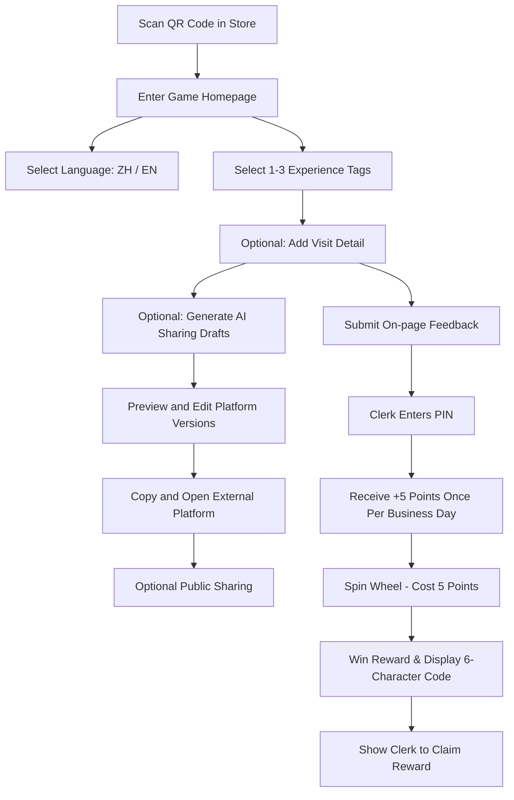

# Product Requirement Document (PRD): Interactive Lucky Wheel Game Module (AI-Vue)

## 1. Executive Summary & Goals

The AMC Interactive Lucky Wheel Game (AI-Vue) is an on-the-spot customer engagement widget. Customers submit brief, genuine visit feedback for clerk-confirmed points and may optionally use an AI assistant to create editable sharing drafts for enabled external platforms. Public posting is never required for points or prizes.

### Key Objectives:
- **Genuine Visit Feedback**: Collect lightweight, structured visit feedback without requiring public posting.
- **Optional Sharing Assistant**: Turn customer-selected experience details into editable, platform-specific drafts without fabricating claims or influencing ratings.
- **Zero Friction**: Eliminate login barriers. Customer participation is session-based and instantaneous.
- **Clerk-Oriented Controls**: Simplify task validation and prize claiming with a direct 6-digit PIN entry on the customer's device.

---

## 2. User Scenarios & UX Flow

### 2.1 Customer H5 Experience (Mobile First)



- **UI Details**: Mobile-first white cards on a neutral background, with a merchant-colored header and game accents. The wheel/grid, feedback input, platform drafts, PIN confirmation, and prize pool remain readable at a 390 px viewport without horizontal scrolling.
- **Experience Input**: Customers choose one to three tags from food/drink, service, ambience, value, speed, and other. An optional detail is limited to 240 characters; selecting other requires a detail.
- **Independent Actions**: “Generate sharing drafts” is available without a clerk PIN and never awards points. “Submit feedback and receive 5 points” creates a pending feedback task for clerk PIN confirmation. Neither action depends on opening or publishing to an external platform.
- **Editable Platform Drafts**: One generation returns versions only for enabled Google Review, Xiaohongshu, and Instagram channels. Each version is editable before a full-width “Copy and open” action. Google drafts contain no hashtags, requested rating, or promotional reward language; social drafts use at most five relevant hashtags.
- **Return Continuity**: Server-generated drafts can be restored after refresh. Customer edits and the opened platform are stored in `brandId`-scoped `sessionStorage`; customer edits are not written back to the server.
- **Accessibility and Failure Handling**: The generator, tags, editors, and platform actions provide bilingual labels, ARIA state, visible keyboard focus, and touch feedback. Clipboard failure keeps the customer on the page and exposes manual-copy guidance instead of navigating away.

### 2.2 Merchant Dashboard & Table Tent QR Poster

- **Merchant Controls**:
  - Customize and download printable PDF table tents with brand logos and call-to-actions.
  - Set game configuration: customize wheel segments, win probabilities, and Clerk PIN.
  - Track prize inventory and claimed coupons.
  - Use one permanent QR code per brand. The QR payload is always `https://amc-kanban.immedi.ai/game/{brandId}` and never contains a prize ID, configuration ID, timestamp, or version.
  - Saving reward, probability, inventory, poster copy, or poster theme changes takes effect immediately for future visits without requiring the merchant to reprint the QR sticker.

---

## 3. Detailed Feature Requirements

### 3.1 Session & Auth Management (Zero Login)
- No email, phone, or password inputs required for the customer.
- H5 generates a random UUID client-side and stores it in `localStorage` under `amc-game-session:{brandId}`.
- Points, feedback tasks, AI share drafts, and spin logs are bound to the `sessionId` + `brandId`.
- Session is transient. Clearing browser cache deletes points and uncollected prizes.

### 3.2 Genuine Feedback Points Task
- The customer submits one to three normalized experience tags and an optional detail. The task type is `EXPERIENCE_FEEDBACK` and starts as `PENDING`.
- A valid clerk PIN changes the task to `APPROVED` and grants exactly 5 points. The same game session can receive this reward only once per brand business day.
- Cached clients may still submit `REVIEW_SUBMIT`; the server normalizes it to the same once-per-day feedback reward and ignores `reviewPlatform` when determining eligibility.
- `/api/game/status` returns the current business day's feedback task so pending PIN and already-awarded states survive refresh.

### 3.3 AI Sharing Drafts & Abuse Protection
- The public draft endpoint validates an existing game session, enabled platforms, locale, one-to-three allowed tags, and the 240-character detail limit.
- One model call returns structured drafts for all enabled platforms. The prompt uses only customer-provided experience and minimal public brand facts; invalid output or unavailable AI falls back to deterministic editable templates.
- Google output must remain neutral and must never request a rating or mention incentives, discounts, free goods, or rewards. This follows the [Google Maps policy on incentivized reviews](https://support.google.com/contributionpolicy/answer/16597558?hl=en) and [Google Maps contributed-content policy](https://support.google.com/contributionpolicy/answer/7400114?hl=en-GB).
- Limits are three generation attempts per session/business day, 60 AI calls per HMAC-anonymized IP/business day, and 300 AI calls per brand/business day. Quota reservation is atomic; raw IP addresses are never stored.
- Reaching the session limit returns the latest draft without another model call. IP/brand limits or model failure return a template fallback so the customer never reaches a dead end.

### 3.4 Spin Resilience & Guardrails
- **Spin Crash Protection**: If the browser reloads or crashes mid-spin, the server has already committed the spin event. Upon remounting, the H5 queries `/api/game/status`. If an unclaimed (`UNCLAIMED`) prize exists, it bypasses the spin animation and directly shows the redemption card.
- **Infinite/Limited Inventories**: Prize inventories support numeric limits or `Null` representing infinite supply. The server enforces transactional inventory decrements on spin.
- **Reward Identity**: Changing a reward name or type creates a new reward definition with fresh inventory and claim counters. Probability or inventory-limit-only edits retain the existing reward identity and counters.
- **Issued Reward Preservation**: Every spin log snapshots the reward name, type, and image at win time. Later reward edits or deletion never change an issued reward, its redemption terms, or its expiry.

---

## 4. Prisma Database Schema

```prisma
model GameConfig {
  id                 String      @id @default(cuid())
  brandId            String      @unique
  brand              Brand       @relation(fields: [brandId], references: [id], onDelete: Cascade)
  
  title              String      @default("Lucky Spin Wheel")
  description        String?     
  themeColor         String      @default("#3b82f6") 
  
  taskPhotoEnabled   Boolean     @default(true)
  taskReviewEnabled  Boolean     @default(true)
  clerkPin           String      @default("123456")
  maxSpinsPerUserDay Int         @default(3)
  
  prizes             GamePrize[]
  createdAt          DateTime    @default(now())
  updatedAt          DateTime    @updatedAt
}

model GamePrize {
  id                 String      @id @default(cuid())
  gameConfigId       String
  gameConfig         GameConfig  @relation(fields: [gameConfigId], references: [id], onDelete: Cascade)
  
  name               String      
  type               String      // COUPON | PHYSICAL | POINTS | THANKS
  probability        Float       
  totalInventory     Int?        // Null represents infinite inventory
  claimedCount       Int         @default(0)
  imageUrl           String?
  
  spinLogs           GameSpinLog[]
  
  createdAt          DateTime    @default(now())
  updatedAt          DateTime    @updatedAt
}

model GameSession {
  id                 String                   @id @default(cuid())
  brandId            String
  brand              Brand                    @relation(fields: [brandId], references: [id], onDelete: Cascade)
  
  sessionId          String                   
  pointsBalance      Int                      @default(0)
  
  tasks              CustomerTaskSubmission[]
  spinLogs           GameSpinLog[]
  shareDrafts        GameShareDraft[]

  createdAt          DateTime                 @default(now())
  updatedAt          DateTime                 @updatedAt

  @@unique([brandId, sessionId])
}

model CustomerTaskSubmission {
  id                 String           @id @default(cuid())
  sessionId          String
  session            GameSession      @relation(fields: [sessionId], references: [id], onDelete: Cascade)
  brandId            String
  
  taskType           String           
  status             String           @default("PENDING") 
  pointsAwarded      Int              @default(0)
  experienceTags     String[]         @default([])
  experienceNote     String?
  rewardDate         String?
  
  images             String[]         
  imageMd5s          String[]         
  copyrightAgreed    Boolean          @default(true)
  
  reviewPlatform     String?          
  reviewTimeRaw      String?          
  
  isManualOverride   Boolean          @default(false) 
  reviewedAt         DateTime?
  
  createdAt          DateTime         @default(now())

  @@unique([sessionId, taskType, rewardDate])
}

model GameShareDraft {
  id                 String           @id @default(cuid())
  brandId            String
  sessionId          String
  session            GameSession      @relation(fields: [sessionId], references: [id], onDelete: Cascade)
  activityDate       String
  locale             String
  experienceTags     String[]         @default([])
  experienceNote     String?
  drafts             Json?
  generationSource   String           @default("fallback")
  generationCount    Int              @default(0)
  aiCallCount        Int              @default(0)
  ipHash             String?
  lastLimitReason    String?
  generatedAt        DateTime?
  createdAt          DateTime         @default(now())
  updatedAt          DateTime         @updatedAt

  @@unique([sessionId, activityDate])
  @@index([brandId, activityDate])
  @@index([ipHash, activityDate])
}

model GameSpinLog {
  id                 String           @id @default(cuid())
  sessionId          String
  session            GameSession      @relation(fields: [sessionId], references: [id], onDelete: Cascade)
  prizeId            String?
  prize              GamePrize?       @relation(fields: [prizeId], references: [id], onDelete: SetNull)
  prizeNameSnapshot  String
  prizeTypeSnapshot  String
  prizeImageSnapshot String?
  
  pointsDeducted     Int              @default(5)
  redemptionCode     String           @unique 
  status             String           @default("UNCLAIMED") // UNCLAIMED | CLAIMED | EXPIRED
  
  claimedAt          DateTime?
  expiresAt          DateTime?
  
  createdAt          DateTime         @default(now())
}
```

---

## 5. Security & Operation Safeguards

### 5.1 Rate Limiting & API Shielding
1. **AI quota reservation**: A serializable database transaction atomically reserves at most 3 generations per brand/session/business day, 60 model calls per HMAC-anonymized IP/day, and 300 model calls per brand/day.
2. **IP privacy**: The server stores only a one-way HMAC of a trusted client IP. If no trusted IP is available, session and brand limits still apply.
3. **Safe fallback**: Model unavailability, invalid structured output, or IP/brand exhaustion returns deterministic editable templates with `source: "fallback"`; session exhaustion returns the latest draft without another model call.
4. **Spin integrity**: Point deduction and prize selection remain server-side; the client cannot supply a chosen prize.

### 5.2 Experience Data Boundary
Experience tags, the optional note, and the latest generated server draft are retained for task audit and refresh recovery. Customer edits remain only in brand-scoped `sessionStorage`. AMC does not track publication, request screenshots, or ingest public posts as proof for points. Draft generation may use only customer-provided experience and published merchant facts; the UI continuously asks the customer to verify truthfulness before sharing.
