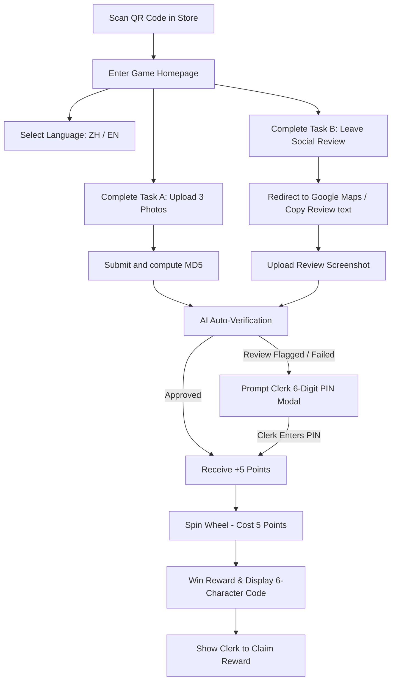

# Product Requirement Document (PRD): Interactive Lucky Wheel Game Module (AI-Vue)

## 1. Executive Summary & Goals

The AMC Interactive Lucky Wheel Game (AI-Vue) is an on-the-spot, offline-to-online marketing widget integrated directly into the AMC platform. It allows retail merchants (e.g., cafés, restaurants, retail shops) to display QR codes in-store, driving customers to complete simple actions (uploading shop photos, posting social media reviews) to earn points and spin a digital lucky wheel for instant rewards.

### Key Objectives:
- **UGC Collection**: Drive authentic in-store customer photo uploads (UGC) and automatically ingest them into AMC's AI Agent workflow for automated social publishing.
- **Social Review Booster**: Motivate high-quality Google Maps and Yelp reviews in real-time.
- **Zero Friction**: Eliminate login barriers. Customer participation is session-based and instantaneous.
- **Clerk-Oriented Controls**: Simplify task validation and prize claiming with a direct 6-digit PIN entry on the customer's device.

---

## 2. User Scenarios & UX Flow

### 2.1 Customer H5 Experience (Mobile First)



- **H5 Visual Mockup**:
  
  
- **UI Details**: Dark-mode glassmorphic interface with neon glow indicators. Custom CSS-based bezier transition wheel with confetti overlays on win, and device haptic vibrations.

### 2.2 Merchant Dashboard & Table Tent QR Poster

- **Poster Mockup**:
  

- **Merchant Controls**:
  - Customize and download printable PDF table tents with brand logos and call-to-actions.
  - Set game configuration: customize wheel segments, win probabilities, and Clerk PIN.
  - Track prize inventory and claimed coupons.

---

## 3. Detailed Feature Requirements

### 3.1 Session & Auth Management (Zero Login)
- No email, phone, or password inputs required for the customer.
- H5 generates a random UUID client-side and stores it in `localStorage` under `amc_game_session`.
- Points, uploaded tasks, and spin logs are bound to the `sessionId` + `brandId`.
- Session is transient. Clearing browser cache deletes points and uncollected prizes.

### 3.2 Points Task & AI Validation
#### Task A: Store Photo Upload
- Customers upload exactly 3 photos of the store.
- **Copyright Consent**: A checkbox stating *"I authorize the merchant to use these images for AI content generation and marketing purposes"* is displayed and pre-checked. Users cannot submit without consenting.
- **Client-Side Image Compression**: H5 scales down uploaded images using HTML5 Canvas to <1MB and converts to WebP before transmission to optimize bandwidth.

#### Task B: Google Maps & Social Review
- User clicks "Write a Review", which opens:
  `https://search.google.com/local/writereview?placeid=<Google_Place_Id>`
  This deep link opens Google Maps app directly to the 5-star review page.
- **Clipboard integration**: Automatically copy brand's recommended review text/tags to the customer's clipboard.
- User takes a screenshot of the review and uploads it.

#### Verification & Clerk Overrides:
1. **AI OCR Analysis**: System reads screenshot using **Gemini Vision API**. It validates:
   - Platform name (Google Maps, Yelp, etc.).
   - Brand name matching the store.
   - Review timing (flags if the review is older than 3 days, checking for phrases like "1 year ago").
2. **AI Approved**: Points are granted immediately.
3. **AI Rejected/Flagged**: Instead of rejecting, the screen presents a 6-digit PIN input panel. The customer hands their phone to the clerk, who physically enters the brand's store PIN (e.g. `123456`) to manually override and issue points.

### 3.3 Anti-Cheating & Image Deduplication
- **MD5 Hash Check**: Server checks the MD5 hashes of uploaded images against the **latest 30 submissions** for this brand. If duplicate found, reject submission.
- **Review Date Match**: AI validation checks relative date context. Old reviews cannot be reused.

### 3.4 Spin Resilience & Guardrails
- **Spin Crash Protection**: If the browser reloads or crashes mid-spin, the server has already committed the spin event. Upon remounting, the H5 queries `/api/game/status`. If an unclaimed (`UNCLAIMED`) prize exists, it bypasses the spin animation and directly shows the redemption card.
- **Infinite/Limited Inventories**: Prize inventories support numeric limits or `Null` representing infinite supply. The server enforces transactional inventory decrements on spin.

---

## 4. Prisma Database Schema

```prisma
model GameConfig {
  id                 String      @id @default(cuid())
  brandId            String      @unique
  brand              Brand       @relation(fields: [brandId], references: [id], onDelete: Cascade)
  
  title              String      @default("Lucky Spin Wheel")
  description        String?     
  themeColor         String      @default("#3b82f6") 
  
  taskPhotoEnabled   Boolean     @default(true)
  taskReviewEnabled  Boolean     @default(true)
  clerkPin           String      @default("123456")
  maxSpinsPerUserDay Int         @default(3)
  
  prizes             GamePrize[]
  createdAt          DateTime    @default(now())
  updatedAt          DateTime    @updatedAt
}

model GamePrize {
  id                 String      @id @default(cuid())
  gameConfigId       String
  gameConfig         GameConfig  @relation(fields: [gameConfigId], references: [id], onDelete: Cascade)
  
  name               String      
  type               String      // COUPON | PHYSICAL | POINTS | THANKS
  probability        Float       
  totalInventory     Int?        // Null represents infinite inventory
  claimedCount       Int         @default(0)
  imageUrl           String?
  
  spinLogs           GameSpinLog[]
  
  createdAt          DateTime    @default(now())
  updatedAt          DateTime    @updatedAt
}

model GameSession {
  id                 String                   @id @default(cuid())
  brandId            String
  brand              Brand                    @relation(fields: [brandId], references: [id], onDelete: Cascade)
  
  sessionId          String                   
  pointsBalance      Int                      @default(0)
  
  tasks              CustomerTaskSubmission[]
  spinLogs           GameSpinLog[]

  createdAt          DateTime                 @default(now())
  updatedAt          DateTime                 @updatedAt

  @@unique([brandId, sessionId])
}

model CustomerTaskSubmission {
  id                 String           @id @default(cuid())
  sessionId          String
  session            GameSession      @relation(fields: [sessionId], references: [id], onDelete: Cascade)
  brandId            String
  
  taskType           String           
  status             String           @default("PENDING") 
  pointsAwarded      Int              @default(0)
  
  images             String[]         
  imageMd5s          String[]         
  copyrightAgreed    Boolean          @default(true)
  
  reviewPlatform     String?          
  reviewTimeRaw      String?          
  
  isManualOverride   Boolean          @default(false) 
  reviewedAt         DateTime?
  
  createdAt          DateTime         @default(now())
}

model GameSpinLog {
  id                 String           @id @default(cuid())
  sessionId          String
  session            GameSession      @relation(fields: [sessionId], references: [id], onDelete: Cascade)
  prizeId            String
  prize              GamePrize        @relation(fields: [prizeId], references: [id])
  
  pointsDeducted     Int              @default(5)
  redemptionCode     String           @unique 
  status             String           @default("UNCLAIMED") // UNCLAIMED | CLAIMED | EXPIRED
  
  claimedAt          DateTime?
  expiresAt          DateTime?
  
  createdAt          DateTime         @default(now())
}
```

---

## 5. Security & Operation Safeguards

### 5.1 Rate Limiting & API Shielding
To prevent bad actors from script-spamming routes (e.g. generating infinite Sessions or Mock Photo Uploads):
1. **IP Rate Limit**: Limit creation of `GameSession` records to 5 per IP address per hour.
2. **File Size and Type Restraints**: Upload endpoints validate magic bytes of images to prevent uploading malicious executable files disguised as screenshots.
3. **Spin Signature Verification**: The spinning logic deducts points and calculates rewards on the server-side only. Client cannot supply "chosen" prizes.

### 5.2 UGC Asset Ingestion Pipeline
Once a customer's photo submission is approved:
1. AMC transfers the WebP image files asynchronously to the merchant's **Lark Drive Folder**.
2. AMC registers them in the `MediaAsset` catalog labeled `customer_ugc`.
3. Gemini triggers automated tagging, aesthetic rating, and pre-writes social copy, queueing it up as a draft in the merchant dashboard.
