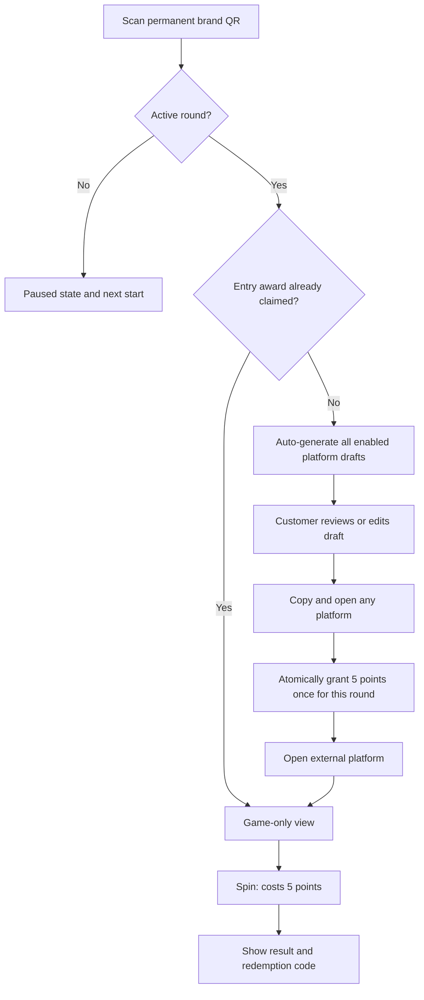

# Product Requirement Document: Interactive Lucky Wheel Game

## 1. Current Product Contract

The customer activity uses one permanent brand QR URL: `https://amc-kanban.immedi.ai/game/{brandId}`. Activity dates, prize configuration, and round identifiers never appear in the QR payload.

Each brand schedules explicit activity rounds. A round is active for the half-open UTC interval `[startsAt, endsAt)`, displayed and edited in the brand timezone. Rounds for the same game cannot overlap. When no round is active, draft generation, entry-point awards, and spins are paused; the public page shows the next scheduled start when available.

During an active round, the first customer screen automatically prepares editable drafts for every enabled platform among Google, Xiaohongshu, and Instagram. The first successful “copy and open” action on any enabled platform grants 5 points. The system rewards the platform-opening action only: it does not verify, track, or claim that a public review or post was submitted. A database uniqueness constraint guarantees one entry award per activity round and anonymous browser session.

After the entry award has been claimed, returning to the page or scanning the permanent QR again opens the game-only view. That view contains points, wheel/grid, results, unclaimed rewards, and the prize pool; it does not contain the sharing cards or an “Optional public sharing” section.

## 2. Customer Flow



- Browser language selects Chinese or English draft output; there is no manual language picker.
- All enabled platform drafts are generated in one request and remain editable. Google comes first visually, followed by Xiaohongshu and Instagram.
- Before copying, the customer confirms that the edited text reflects their genuine experience. Google output must not request a star rating or mention points, prizes, discounts, free goods, or incentives.
- Clipboard failure and reward-request failure keep the customer on the page. Navigation occurs only after copying succeeds and the reward endpoint returns either newly awarded or already claimed.
- The anonymous identity is the existing `brandId`-scoped local-storage session. Clearing browser data or changing devices creates a new anonymous identity.
- Returning through `pageshow` or page visibility refreshes the server status so the game view appears without relying on the current point balance.

## 3. Merchant Flow and Round Scheduling

- Merchants can create multiple rounds with explicit start and end times. Times are entered in the brand timezone and stored as UTC. A new round may start in the past when its end remains in the future; it becomes active immediately.
- A future round may be edited or deleted. Once active, its start is locked and only its end may be changed, subject to validity and overlap checks. Ended rounds are read-only.
- Starting a new round resets only entry-award eligibility. Existing points, daily spin counts, prize inventory, issued rewards, redemption records, and permanent QR codes remain unchanged.
- The dashboard shows scheduled, active, and ended states. A game with no active round is intentionally paused.
- Super Rola is not backfilled with an automatic round during rollout; its first round must be scheduled explicitly in the dashboard.

## 4. Data and API Contract

### 4.1 Models

```prisma
model GameActivityRound {
  id           String     @id @default(cuid())
  gameConfigId String
  gameConfig   GameConfig @relation(fields: [gameConfigId], references: [id], onDelete: Cascade)
  startsAt     DateTime
  endsAt       DateTime
  entryRewards GameEntryReward[]
  createdAt    DateTime   @default(now())
  updatedAt    DateTime   @updatedAt

  @@index([gameConfigId, startsAt, endsAt])
}

model GameEntryReward {
  id            String            @id @default(cuid())
  roundId       String
  round         GameActivityRound @relation(fields: [roundId], references: [id], onDelete: Cascade)
  sessionId     String
  session       GameSession       @relation(fields: [sessionId], references: [id], onDelete: Cascade)
  platform      String
  pointsAwarded Int               @default(5)
  createdAt     DateTime          @default(now())

  @@unique([roundId, sessionId])
  @@index([sessionId, createdAt])
}
```

### 4.2 APIs

- `GET/POST/PATCH/DELETE /api/game/rounds`: authenticated round management. Mutations require brand ownership, reject overlaps, and enforce future/active/ended edit rules.
- `POST /api/game/entry-reward`: public atomic award endpoint accepting `brandId`, public `sessionId`, and enabled `platform`. The server resolves the active round and never trusts a client round ID. No active round returns `409` with `code: "ACTIVITY_INACTIVE"`.
- `GET /api/game/status`: returns points and prize state plus `activeRound`, `nextRound`, and `entryRewardClaimed` for the current round.
- `POST /api/game/share-drafts`: requires an active round and `mode: "AUTO"`; one generation returns all enabled platforms. Existing quota and deterministic fallback protections remain.
- `POST /api/game/spin`: requires an active round in addition to existing balance, daily-limit, inventory, and server-side random-selection checks.

Reward creation and the 5-point increment occur in one serializable transaction. The unique `[roundId, sessionId]` constraint and duplicate handling make rapid clicks and retries idempotent.

## 5. Acceptance and Safety

- Google, Xiaohongshu, or Instagram may be the first rewarded platform; later platform opens in the same round do not add points.
- A new round makes the same anonymous session eligible for one new entry award.
- No active round prevents generation, awarding, and spinning without deleting balances or history.
- Prize edits preserve the existing permanent-QR and issued-prize snapshot contracts.
- Public copy says that the reward is for the first platform-opening action. It must never say AMC verified a review or post.
- Round management, reward idempotency, page restoration, deep links, clipboard failure, inactive state, prize history, typecheck, and production build are required release checks.
