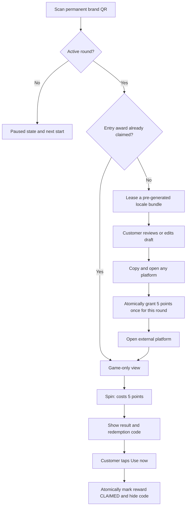

# Product Requirement Document: Interactive Lucky Wheel Game

## 1. Current Product Contract

The customer activity uses one permanent brand QR URL: `https://amc-kanban.immedi.ai/game/{brandId}`. Activity dates, prize configuration, and round identifiers never appear in the QR payload.

Each brand schedules explicit activity rounds. A round is active for the half-open UTC interval `[startsAt, endsAt)`, displayed and edited in the brand timezone. Rounds for the same game cannot overlap. When no round is active, draft generation, entry-point awards, and spins are paused; the public page shows the next scheduled start when available.

During an active round, the first customer screen leases an already-generated editable draft bundle for every enabled platform among Google, Xiaohongshu, and Instagram. The public request path never waits for an LLM. Each brand keeps five Chinese and five English bundles for the current brand/platform fingerprint; an empty pool returns an immediate conservative template and queues a refill. The first successful “copy and open” action on any enabled platform grants 5 points and consumes the leased bundle in the same transaction. The system rewards the platform-opening action only: it does not verify, track, or claim that a public review or post was submitted. A database uniqueness constraint guarantees one entry award per activity round and anonymous browser session.

After the entry award has been claimed, returning to the page or scanning the permanent QR again opens the game-only view. That view contains points, wheel/grid, results, issued-reward history, and the prize pool; it does not contain the sharing cards or an “Optional public sharing” section. A customer can immediately redeem their own non-thank-you reward from the result or history card without a staff PIN or confirmation dialog. Successful redemption irreversibly invalidates the code, keeps a masked Used record and timestamp visible, and remains available for valid issued rewards even while no activity round is active.

## 2. Customer Flow



- Browser language selects Chinese or English draft output; there is no manual language picker. The customer hero uses fixed localized copy: `立即评价，获取积分抽奖` or `Review now, earn points, and spin to win`; it never renders the database `description` as the public CTA.
- All enabled platform drafts come from one leased bundle and remain editable. Google comes first visually, followed by Xiaohongshu and Instagram. The old Prepare heading, generation counter, AI/fallback notices, confirmation checkbox, and AI progress state are not shown.
- Draft text must remain conservative and editable. Google output must not request a star rating or mention points, prizes, discounts, free goods, or incentives.
- Clipboard failure and reward-request failure keep the customer on the page. Navigation occurs only after copying succeeds and the reward endpoint returns either newly awarded or already claimed.
- The anonymous identity is the existing `brandId`-scoped local-storage session. Clearing browser data or changing devices creates a new anonymous identity.
- Returning through `pageshow` or page visibility refreshes the server status so the game view appears without relying on the current point balance.
- The localized `立即使用` / `Use now` action performs a one-tap self-redemption. While the request is pending it is disabled; a failed request keeps the code valid and retryable. A claimed reward remains visible with `已使用` / `Used`, `claimedAt`, and no complete redemption code.

## 3. Merchant Flow and Round Scheduling

- Merchants can create multiple rounds with explicit start and end times. Times are entered in the brand timezone and stored as UTC. A new round may start in the past when its end remains in the future; it becomes active immediately.
- A future round may be edited or deleted. Once active, its start is locked and only its end may be changed, subject to validity and overlap checks. Ended rounds are read-only.
- Starting a new round resets only entry-award eligibility. Existing points, daily spin counts, prize inventory, issued rewards, redemption records, and permanent QR codes remain unchanged.
- The dashboard shows scheduled, active, and ended states. A game with no active round is intentionally paused.
- Super Rola is not backfilled with an automatic round during rollout; its first round must be scheduled explicitly in the dashboard.
- The game dashboard shows Chinese and English pool availability, active leases, generation status, last generation/error, and a manual “refill to 5” action. Saving game/platform settings or creating a round queues a refill automatically.

## 4. Data and API Contract

### 4.1 Models

```prisma
model GameActivityRound {
  id           String     @id @default(cuid())
  gameConfigId String
  gameConfig   GameConfig @relation(fields: [gameConfigId], references: [id], onDelete: Cascade)
  startsAt     DateTime
  endsAt       DateTime
  entryRewards GameEntryReward[]
  createdAt    DateTime   @default(now())
  updatedAt    DateTime   @updatedAt

  @@index([gameConfigId, startsAt, endsAt])
}

model GameEntryReward {
  id            String            @id @default(cuid())
  roundId       String
  round         GameActivityRound @relation(fields: [roundId], references: [id], onDelete: Cascade)
  sessionId     String
  session       GameSession       @relation(fields: [sessionId], references: [id], onDelete: Cascade)
  platform      String
  pointsAwarded Int               @default(5)
  createdAt     DateTime          @default(now())

  @@unique([roundId, sessionId])
  @@index([sessionId, createdAt])
}
```

`GameShareDraftPoolItem` stores one locale bundle, its configuration fingerprint, availability/reservation/use state, reservation session and round, lease expiry, used platform, source, and audit timestamps. `GameShareDraftPoolState` stores one row per game configuration and locale with the current fingerprint, target stock, generation state, task lease, counters, last generation time, and last error. Existing `GameShareDraft` rows remain historical and are not migrated or deleted.

### 4.2 APIs

- `GET/POST/PATCH/DELETE /api/game/rounds`: authenticated round management. Mutations require brand ownership, reject overlaps, and enforce future/active/ended edit rules.
- `POST /api/game/entry-reward`: public atomic award endpoint accepting `brandId`, public `sessionId`, enabled `platform`, and optional leased `draftId`. The server resolves the active round and never trusts a client round ID. A valid draft is consumed in the same transaction as the one-time reward; fallback requests without a `draftId` remain eligible. No active round returns `409` with `code: "ACTIVITY_INACTIVE"`.
- `GET /api/game/status`: returns points and the latest issued reward state plus `activeRound`, `nextRound`, and `entryRewardClaimed` for the current round. Claimed rewards include `claimedAt` but return `redemptionCode: null`; expired unclaimed rewards are exposed as `EXPIRED`.
- `GET /api/game/share-drafts`: requires an active round and leases a database bundle for `brandId`, `sessionId`, and browser `locale`. The same session/round gets the same bundle, the lease lasts 15 minutes and can be renewed, and expired abandoned leases return to stock. This public route never invokes an LLM.
- `GET/POST /api/game/share-draft-pool`: authenticated brand-owner inventory/status read and asynchronous refill request. POST returns `202`.
- `POST /api/cron/game-share-draft-pool`: `x-cron-secret` protected one-minute recovery worker for pending, under-stocked, or failed pool jobs.
- `POST /api/game/spin`: requires an active round in addition to existing balance, daily-limit, inventory, and server-side random-selection checks, and returns the created `spinLogId` for secure self-redemption.
- `POST /api/game/redemptions/self`: accepts `brandId`, anonymous `sessionId`, and `spinLogId`; it verifies session ownership and atomically transitions a valid reward from `UNCLAIMED` to `CLAIMED`. Repeated requests by the same owner are idempotent, expired rewards return `409 REDEMPTION_EXPIRED`, and foreign rewards return `404`.
- `GET/POST /api/game/redemptions`: preserves the staff-PIN lookup and redemption flow while sharing the same atomic claim transition as customer self-redemption.

Reward creation and the 5-point increment occur in one serializable transaction. The unique `[roundId, sessionId]` constraint and duplicate handling make rapid clicks and retries idempotent.

## 5. Acceptance and Safety

- Google, Xiaohongshu, or Instagram may be the first rewarded platform; later platform opens in the same round do not add points.
- A new round makes the same anonymous session eligible for one new entry award.
- No active round prevents generation, awarding, and spinning without deleting balances or history.
- Prize edits preserve the existing permanent-QR and issued-prize snapshot contracts.
- Customer and staff redemption requests racing for the same reward produce one `CLAIMED` transition and one stable `claimedAt`; later attempts never reactivate or overwrite the code.
- Public copy says that the reward is for the first platform-opening action. It must never say AMC verified a review or post.
- The pool fingerprint includes brand name, location, description, public menu, and enabled platforms. Stale-fingerprint bundles are never assigned. A successful consumption queues exactly the missing replacement; concurrent workers cannot take stock above five reusable bundles per locale.
- Round management, pool leasing/refill, reward idempotency, page restoration, deep links, clipboard failure, inactive state, prize history, typecheck, and production build are required release checks.
