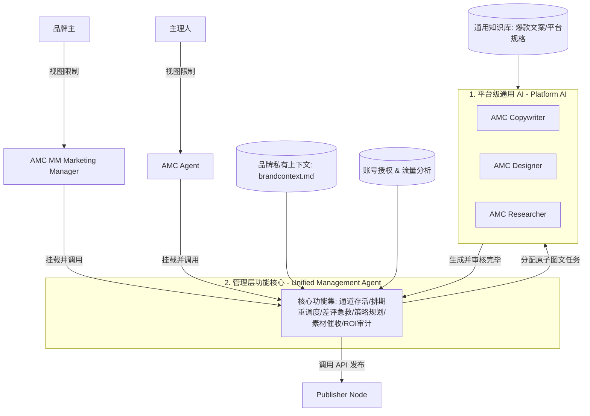

# AMC 三级智能体技能与知识库架构设计 (Three-Tier Agent Skills & KB Design)

本文档旨在设计 AMC 看板平台中智能体（Platform AI、AMC MM / AMC Agent）的核心工作机制、技能集定义以及底层的知识库建设方案，并参考 Postiz 实现人机协同闭环。

---

## 🏗️ 整体架构关系图

平台 AI 提供原子级图文生产能力，而管理层 AI 具有完全一致的运营与安全管理能力，仅在**数据与账号权限范围（Permission Scope）**上进行隔离：



---

## 1. 平台级通用 AI (Platform AI)

通用底座，负责底层的“重度体力劳动”（图文生成、热点搜索、自动裁剪设计）。

### 🛠️ 技能集 (Skills) 与工具 (Tools)
1.  **AMC Researcher (研究员)**
    *   **技能**：自动检索商圈内竞争对手（如周边 3km 餐厅）在 Instagram 或小红书上的爆款贴；提取当前时令或节日的热门 Tag。
    *   **工具**：Google Search API / Yelp API / 小红书爬虫 Shims。
2.  **AMC Copywriter (文案师)**
    *   **技能**：将 Researcher 抓取的素材解构为“Hook（钩子）+ Body（主体）+ Emojis/Tags”，并支持多语种自动翻译与本地化润色。
    *   **工具**：LangChain structured-output / OpenAI translation utility.
3.  **AMC Designer (设计师)**
    *   **技能**：读取生图，进行光影提亮、尺寸剪裁（1:1, 9:16），并自动在指定位置渲染餐厅 Logo 和特惠标签水印。
    *   **工具**：Sharp (Node.js 图像处理库) / Imagen API.

### 📚 知识库建设 (Knowledge Base)
*   **公共图文模板库**：各社交平台（IG, 小红书, Yelp）高转化排版模式（如九宫格、卡片图文字幕规格）。
*   **风味词汇与敏感词库**：预装 Singlish（如 *chope*、*shiok*、*lim kopi*）等本地餐饮常用语；以及针对广告法和平台规则的黑名单过滤词汇。

---

## 2. 管理层 AI (AMC MM & AMC Agent)

管理层 AI 包含 **AMC MM** (品牌主直连) 与 **AMC Agent** (主理人助理)。它们在**核心功能与智能表现上完全一致**，仅因账号角色的不同而在**数据可见度与权限范围**上存在差异。

### 🔐 权限范围隔离 (Permission Partitioning)

| 智能体实例 | 访问身份角色 | 品牌数据与账号可见范围 (Scope Limit) | 典型应用场景 |
| :--- | :--- | :--- | :--- |
| **AMC MM** | **品牌主 (Brand Owner)** | **只能看到当前用户自己的全部品牌**（单租户/单商家数据边界，隔离其他品牌主数据）。 | 餐厅老板登录后台，查看自身旗下 3 家连锁店的内容日历、待审批草稿及 ROI 报告。 |
| **AMC Agent** | **主理人 (Coordinator/Operator)** | **可以看到该主理人负责的多个不同用户的品牌**（跨租户/跨商户数据边界，协助主理人代运营）。 | AMC 服务商主理人登录系统，集中管理并审批旗下托管的 10 家不同餐饮商家的多平台内容。 |

---

### 🛠️ 核心功能集 (Shared Features)

1.  **主动策略规划 (Proactive Strategy Pitching)**
    *   **技能**：自动比对本地假期列表（如端午节、新加坡国庆日），提前 14 天自动向用户发送 A/B 双套营销方案提案卡片。
2.  **素材催收 (Asset Requesting)**
    *   **技能**：当发现内容日历缺乏图片或视频素材时，主动触发通知索取照片（“请拍 2 张后厨煎牛排的照片给我”）。
3.  **通道状态监控 (Alive Guard)**
    *   **技能**：定期检测绑定平台（IG, Yelp, Google Business Maps）的 Access Token 状态。一旦过期，在日历及侧边栏挂载高亮警告标志。
4.  **排期异常重调度 (Rescheduling)**
    *   **技能**：发帖失败时自动执行退避重试，若失败则将任务回退为 `pending` 状态，并在日历中提示主理人/品牌主重新拖拽排期。
5.  **差评急救警报 (Review Escalation)**
    *   **技能**：监控 Google Maps/Yelp 评分，检测到 $\le 3$ 星评价时，立刻推送紧急警报并提供 2 套 AI 回复公关方案。
6.  **引流 ROI 数据审计 (ROI Auditor)**
    *   **技能**：统计专属优惠码或预订链接的核销率，输出引流效果分析报表。

---

### 📚 知识库建设 (Knowledge Base)

*   **品牌私有上下文库 (`brandcontext.md`)**：包含商家菜品库、客单价、主推新品、优惠限制、以及品牌定位愿景。
*   **账号发布与授权元数据**：存储各渠道的 OAuth Token 生命周期、平台发布限制。
*   **历史流量与发布表现日志**：用于计算特定渠道的最优发帖时间（Optimal Post Time）。

---

## 🤝 平台 Agent 交互与数据流闭环

以一个“端午节 8 折活动”为例，数据流转闭环如下：

```
[AMC MM / AMC Agent] (读取品牌对应的 brandcontext.md 识别招牌菜)
   │
   ├─► 主动向对应账号管理者索取素材照片
   ├─► 生成端午节排期策略卡片 (A/B 提案)
   │
[用户确认方案后] (品牌主在自身视图/主理人在跨店视图审批)
   │
   ├─► 调度底层的 Platform AI 启动
   ├─► Platform Researcher 抓取本周热词 (#端午美食)
   ├─► Platform Copywriter 生成文案草稿
   ├─► Platform Designer 调取素材库图片合成促销标签
   │
[AMC MM / AMC Agent] (发布链路自检)
   │
   ├─► 监控 OAuth Token 是否存活 (权限范围内)
   ├─► 在最优时段自动通过 API 发布
   └─► (若失败) 触发重调度，自动在看板/日历提示重新拖拽排期
```
