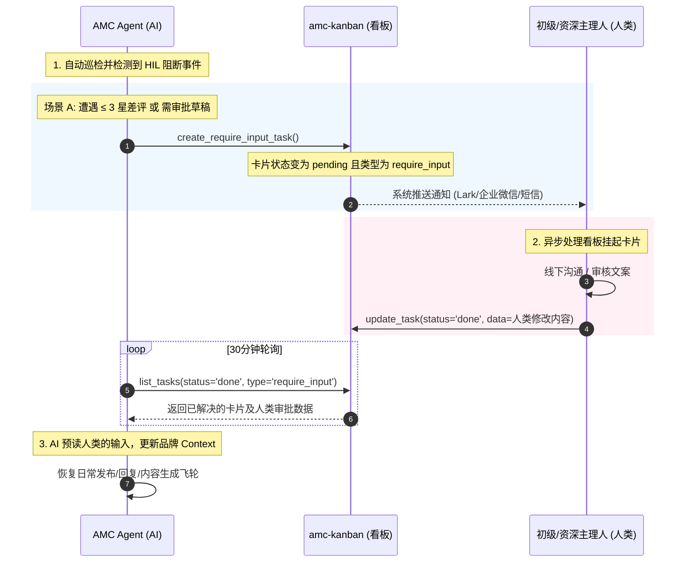

# AMC 核心用户场景与交互用例 (User Case) 设计规范

本文件定义了 **AI 营销看板 (amc-kanban)** 系统中三个核心角色的用户用例 (User Case)，并详细阐述了在 **AI-First & Asynchronous Human-in-the-Loop (HIL)** 异步人机协同模式下，如何结合**新加坡餐饮市场本地化特点（多语言、多平台、搜索决策链）、PSG政府补贴资助**以及**资深主理人/初级主理人的具体工作职责（Presales提案、续约率、SOP质检）**，实现高效、合规的自媒体运营闭环。

---

## 1. 核心设计理念 (Philosophy)

本系统遵循 **“AI 自动推进日常 90% 流程，人类异步审查把关 10% 关键节点”** 的异步飞轮机制，并结合新加坡本地 F&B 行业的运营特性：
*   **搜索与点评驱动决策**：新加坡消费者的决策路径高度依赖 Google 搜索/Google Maps 以及 Burpple/Chope 等本地点评平台。因此，AI 员工必须将 **Google Business Profile (GBP)** 和 **Burpple** 口碑管理放在与 Instagram/TikTok 视频内容同等重要的优先级。
*   **多语言与本地化表达（Singlish）**：营销文案绝非简单的中英文翻译，需融入新加坡本地华人或英语社群习惯的口语化表达（如“巴刹 (Pasar)”、“杂菜饭 (Cai Fan)”、“makan”、“chope”等），以建立情感连接。
*   **多民族与合规约束**：在进行穆斯林友好或清真（Halal）认证餐厅推广时，AI 合规官需强制进行食品配料及文案清真合规审查。

---

## 2. 角色定义与职责矩阵 (Role Matrix)

| 角色 | 业务定位 | 主要工具与界面 | 核心职责 |
| :--- | :--- | :--- | :--- |
| **商家 / 客户 (Merchant)** | 餐厅老板、运营总监或多门店管理员 | 商家移动端看板、素材上传页面、Onboarding 问卷页、**WhatsApp 交互式消息通道** | 填写基础品牌/菜系意向；完成账号 OAuth 授权；上传出餐生图和后厨短视频；审批内容日历；咨询 PSG 政府补贴并跟进续约。 |
| **AI 员工 (AMC Agent)** | 定时运行 of AI 运营执行团队（基于 AgentScope 编排） | AgentScope AaaS 守护进程、MCP 工具箱、Studio 可观测台 | 自动提取 Google/Burpple 数据；生成包含 Singlish 的双语文案并筛选图片；定时发布与验证；自动回复 4-5 星好评；异常时生成卡片挂起并报警。 |
| **初级主理人 (Junior BM)** | 日常履约执行人 (与 AI Agent 固定搭档) | 运营级全局看板、KOL 合作管理面板、达人社群、**WhatsApp 异常推送通道** | 引导 Onboarding 流程；执行首月及敏感发布内容审查；人工执行小红书等高风控平台发布；对接筛选 1-5 万粉丝微达人（KOC）。 |
| **资深主理人 (Senior AD)** | 团队品控官与业绩负责人 (汇报给创始人) | 跨品牌全局监控面板、Presales 提案系统、SOP 抽检台、**WhatsApp 危机推送通道** | 配合 BD 进行 Presales 提案拜访；为大客户定制全案品牌策划；抽检初级主理人 SOP 合规率；处理重大舆情危机；提供 PSG 补贴申请咨询；对续约率与满意度负责。 |

### AI 员工内部角色分工 (AgentScope Internal Roles)
1.  **运营协调官 (CoordinatorAgent)**：拆解订阅包配额，规划内容日历排期。
2.  **文案创作者 (CopywriterAgent)**：读取品牌 Context，撰写符合 Singlish 或本地中文习惯的双语文案。
3.  **多媒体筛选员 (AssetCuratorAgent)**：从素材库筛选实拍生图与后厨视频，运行在 Docker 沙箱中进行多媒体处理。
4.  **品牌合规官 (ComplianceOfficerAgent)**：排查新加坡广告法（ASAS/CAP Code）敏感词及 Halal 合规。
5.  **分析师与客服 (AnalystAgent / CSR-Agent)**：拉取 Google Maps 和 Burpple 评论，自动回复好评，抓取平台流量数据。

---

## 3. 核心 User Case 细化

### 3.1 商家 / 客户 (Merchant) 用例

```
┌────────────────────────────────────────────────────────────────────────┐
│                        Merchant 用例生命周期                            │
├─────────────┬─────────────┬─────────────┬──────────────┬───────────────┤
│    UC-M1    │    UC-M2    │    UC-M3    │    UC-M4     │     UC-M5     │
│ 填多语种/清  │ 审批渠道策略 │ 上传后厨/出  │ 监控多渠道曝光 │ 咨询 PSG 补贴 │
│ 真 Onboarding│ 与全渠道日历 │ 餐实拍视频   │ 与 Agent 脑图 │  与套餐续签   │
└─────────────┴─────────────┴─────────────┴──────────────┴───────────────┘
```

#### UC-M1: 填写多民族/多语言/清真餐饮调研问卷 (Multi-cultural Onboarding Survey)
*   **Actor**: 商家 / 客户
*   **Goal**: 提供品牌背景、目标客群族群分布、招牌特色菜及 Halal 认证状态，以便 AI 初始化上下文。
*   **Trigger**: 商家入驻首日，系统自动在看板挂起 `调研问卷` 卡片。
*   **Pre-conditions**: 商家已绑定相应品牌账号。
*   **Happy Path**:
    1. 商家登录 amc-kanban 看板，点击 `调研问卷` 任务卡。
    2. 填写问卷：
       - **主打菜系**：如“新加坡娘惹菜 (Peranakan)”、“川菜 (Szechuan)”。
       - **客群语种偏好**：多选（中英双语 / 纯英文 / 纯中文）。
       - **清真（Halal）认证状态**：已认证 / 认证中 / 非 Halal（对穆斯林营销的策略至关重要）。
       - **招牌菜描述与核心痛点**：如“主打黑胡椒蟹 (Black Pepper Crab)，希望吸引本地中产与外国游客”。
    3. 点击提交，数据序列化写入 `brandcontext.md`。卡片自动流转为 `done`。
*   **Exception Flow**:
    *   *重要字段漏填*：如选择“已认证 Halal”但未上传证书编号/有效期，系统在 30 分钟自检时将卡片退回 `pending(require_input)`，并附带 AI 留言：“请补充您的 Halal 证书备案号以通过内容合规审查”。

#### UC-M2: 审批多平台运营方案与排期日历 (All-Channel Strategy & Calendar Approval)
*   **Actor**: 商家 / 客户
*   **Goal**: 确认 AI 品牌策略师针对 Google Maps、Burpple、Instagram、TikTok、小红书制定的全渠道营销方案与月度内容日历。
*   **Trigger**: Onboarding Step 3 完成，看板生成 `请确认推广方案` 任务。
*   **Pre-conditions**: 商家已完成 UC-M1，且 AI 已完成商圈竞品抓取。
*   **Happy Path**:
    1. 商家登录平台，点击看板上的策略审批卡片。
    2. 预览方案：包含竞品对比分析、多语种发帖排期（例如：每周 3 条 IG Reels 视觉种草，每周 1 条 Google Business Profile 优惠发布，每月 1 次 Burpple Beyond 会员转化活动）。
    3. 商家可在卡片留下批注（如“同意方案，但请将 IG 的周五发布时间从下午 3 点调整到傍晚 6 点以配合下班客流”）。
    4. 点击“同意并采用方案”，卡片状态变为 `done`。
*   **Exception Flow**:
    *   *方案被拒*：商家点击“拒绝并重新生成”，AI 策略师重新根据修改批注在后台调优参数，重新挂载卡片。

#### UC-M3: 上传后厨/菜品实拍短视频与生图 (Raw Media Upload)
*   **Actor**: 商家 / 客户
*   **Goal**: 定期补充没有过度打磨的后厨制作、出餐瞬间手机实拍视频，维持社媒的真实感（High-Authenticity Content）。
*   **Trigger**: AI 运营协调官巡检发现素材库中标记为“未采用”的实拍短视频少于 2 条，自动在看板生成 `补充出餐短视频素材` 卡片。
*   **Pre-conditions**: 商家处于 Growth 或 Scale 订阅套餐中（包含短视频运营）。
*   **Happy Path**:
    1. 商家在手机端收到看板挂起通知。
    2. 打开上传页面，直接使用手机拍摄 1 段 10 秒的“拉丝芝士和牛堡”出餐视频，或上传 3 张后厨爆炒动态图。
    3. 点击上传。Next.js 后端将文件接收并分发至新加坡 OBS 存储。
    4. 自动激活 AssetCuratorAgent 对素材进行打标与分类（如标记为“和牛堡/后厨动态/Reels备选”）。卡片自动更新为 `done`。
*   **Exception Flow**:
    *   *OBS 跨国上传超时/CORS 失败*：系统自动将上传信道降级为 Base64 后端代传模式，无缝切回本地 Next.js 接收接口，保障商户端上传不中断。

#### UC-M4: 监控多渠道流量与 Agent 效率看板 (Performance & COT Monitoring)
*   **Actor**: 商家 / 客户
*   **Goal**: 实时掌握各平台获客数据变化，并审计 AI 团队的执行细节。
*   **Trigger**: 商家随时访问网页。
*   **Pre-conditions**: 商家账号具有相应的品牌权限。
*   **Happy Path**:
    1. 商家进入 Dashboard 监控面板。
    2. 查看多渠道聚合数据：Google 商家展示量、IG 互动率（目标线 $>$ 3%）、Burpple Beyond 兑换张数、外卖平台曝光度。
    3. 点击正在执行的 `In Progress` 任务，右侧抽屉展示 AgentScope Studio 日志，显示 AI 创作者（CopywriterAgent）当前的思维链（COT）过程（如：“*由于目标客户为本地白领，文案需在英语中混合 Singlish 词汇 'chope' 以提升趣味性...*”）。
*   **Exception Flow**: 无。

#### UC-M5: PSG 政府补贴咨询与服务包续签/升级 (PSG Subsidy & Subscription Renewal)
*   **Actor**: 商家 / 客户
*   **Goal**: 了解新加坡生产力解决方案补助金（PSG）申请流程，降低 50% 的数字化运营成本，并办理套餐续签。
*   **Trigger**: 订阅服务到期前 14 天，看板挂起 `服务续签与 PSG 资助评估` 卡片。
*   **Pre-conditions**: 商家企业在新加坡注册，本地股权占比 $\ge$ 30%，年营业额低于 S$1 亿。
*   **Happy Path**:
    1. 商家点击看板卡片，进入续签咨询页。
    2. 点击“申请 PSG 补贴咨询”，系统自动关联该商家的注册资本和本地股权结构信息。
    3. 系统分配**资深主理人 (Senior AD)** 介入，自动生成一份符合 IMDA 要求的数字化营销解决方案提案（含 PSG 预审批 IT 供应商报价单）。
    4. 商家在主理人指导下提交申请，成功获批最高 50% 额度报销。
    5. 商家确认一键续签并升级到 Scale 方案，系统自动更新计费节点。
*   **Exception Flow**:
    *   *资质不符 PSG*：主理人核查后发现商家本地股权不足 30%，则转为推荐本地餐饮商会（SRA）的其他小额扶持计划或维持原价续签。

---

### 3.2 AI 员工 / AI 运营助手 (AMC Agent) 用例

```
┌────────────────────────────────────────────────────────────────────────┐
│                        AMC Agent 用例生命周期                          │
├─────────────┬─────────────┬─────────────┬──────────────┬───────────────┤
│    UC-A1    │    UC-A2    │    UC-A3    │    UC-A4     │  UC-A5 / A6   │
│ 自动爬取 MAP │ 生成 Singlish│ 跨渠道排期  │ 24h 自动回复  │ 差评 HIL 挂起 │
│ 与 Burpple   │ 双语内容草稿 │ 定时发布校验 │ Google好评   │  与周报自调优 │
└─────────────┴─────────────┴─────────────┴──────────────┴───────────────┘
```

#### UC-A1: 自动抓取门店及商圈竞品口碑与评分 (Local Reviews & Competitor Scraping)
*   **Actor**: AMC Agent (分析师与客服 - AnalystAgent)
*   **Goal**: 建立商圈基准线，收集 Google Maps 及 Burpple 上的最新店铺及竞品口碑。
*   **Trigger**: 定时守护进程每天 13:00 与 19:00 激活数据回采。
*   **Pre-conditions**: 平台接入了对应餐厅的 Google Place ID 或商圈竞品配置。
*   **Happy Path**:
    1. Agent 唤醒，通过脱敏 MCP 工具 `google_get_place_info()` 与本地点评 API 抓取自身及商圈前 3 家竞品餐厅的最新评分、客流量趋势和关键词词云。
    2. 发现竞品“和牛汉堡”热度激增，且伴随大量“等位时间长”的负面评价。
    3. Agent 将该数据存入 `competitor_analysis_snapshot.json` 并归档到品牌 Workspace，向 CopywriterAgent 传递消息：“建议下周文案突出我们的‘预约免排队’特色”。
*   **Exception Flow**:
    *   *IP 被限制或爬取失败*：Agent 自动尝试更换本地代理 IP 重试，若连续失败 3 次，将任务记录为 `warning`，并在日志中输出错误代码，不中断其他正常发布流程。

#### UC-A2: 基于本地口语（Singlish）自动撰写多语种文案 (Singlish & Multilingual Copywriting)
*   **Actor**: AMC Agent (文案创作者 + 品牌合规官)
*   **Goal**: 生成既符合新加坡本土文化，又符合广告与行业法规的双语文案。
*   **Trigger**: 协调官 Agent 发起下周内容草稿生成任务。
*   **Pre-conditions**: 品牌上下文 `brandcontext.md` 包含本地化语气偏好。
*   **Happy Path**:
    1. CopywriterAgent 预读品牌大纲，构思一条 Instagram 图文。
    2. 自动撰写英文文案并混入本地口语：“*Don't say we bojio! Chope your seats now for the juiciest Wagyu Burger in town...*”。
    3. 匹配对应的中文本地化表达：“*别说我们没约你！赶紧来占位体验爆汁和牛堡...*”（而非死板的直译“不要说我们没有邀请你”）。
    4. 将内容发送给 **品牌合规官 (ComplianceOfficerAgent)**。
    5. 合规官 Agent 扫描是否包含敏感词（如违反新加坡 ASAS 广告准则的“全网最便宜”、“绝对第一”等极限词汇），且检查该餐厅若为穆斯林餐厅，确保无“Pork”或“Alcohol”等配料描述违规。
    6. 校验通过，调用 `board_save_draft()` 将草稿及选定的实拍图存入看板，卡片置为 `pending` 状态等待终审。
*   **Exception Flow**:
    *   *合规未通过*：合规官 Agent 在内部消息中拦截该文案并打回，指明修改原因：“穆斯林友好（Halal-friendly）品牌推文中检测到疑似酒精调味品描述 'Mirin'，请替换”。CopywriterAgent 自动修正后重新提交。

#### UC-A3: 定时跨渠道发布与真实链接回采 (Scheduled Publishing & URL Scraping)
*   **Actor**: AMC Agent (运营协调官 - CoordinatorAgent)
*   **Goal**: 无人值守情况下精准定时发送内容，并采回真实线上链接。
*   **Trigger**: 轮询时间到达发帖排期设定值。
*   **Pre-conditions**: 任务卡片状态为“主理人已审批通过（approved）”。
*   **Happy Path**:
    1. Agent 定时检索到有待发卡片，拉取已审定的文案和 Singapore OBS 存储的图片。
    2. 对支持官方 API 的渠道（Google Business Profile、Instagram Business、Facebook Page）进行静默发布。
    3. 发布成功 5 分钟后，Agent 调用 `fetch_public_social_profile()` 读取主页最新 Post。
    4. 提取到帖子的真实线上 URL（如 `https://www.instagram.com/p/C_xxxx/`）。
    5. 将 URL 回填看板卡片，状态变更为 `done`，通知商家查阅。
*   **Exception Flow**:
    *   *高风控平台发布*：如检测到目标渠道为小红书，由于 API 频繁调整极易封号，Agent 不执行自动发布，而是调用 `create_require_input_task()`，自动将图片和文案打包成下载包，在看板挂载任务：“【小红书手动发帖】请主理人扫码执行手动发布并回采链接”。

#### UC-A4: 24小时内自动回复 Google Maps & Burpple 优质好评 (Auto-Response to Positive Reviews)
*   **Actor**: AMC Agent (客服 Agent - CSR-Agent)
*   **Goal**: 快速响应消费者，提高 Google 商家资料及本地点评平台的活跃权重。
*   **Trigger**: 定时轮询扫到新未读评论。
*   **Pre-conditions**: 评论评分为 4-5 星，且品牌 `autoPilot == true`。
*   **Happy Path**:
    1. Agent 发现一条 Google Maps 5 星好评：“*Love the Szechuan Spicy Chicken here, super authentic!*”
    2. 客服 Agent 读取菜单知识库，撰写包含细节词的感谢信：“*Thank you for the 5-star review! Our Szechuan Spicy Chicken indeed uses imported peppercorns to keep it authentic. Hope to see you again soon!*”
    3. 调用 Google Business Profile API 执行回复。
    4. 记录日志并在看板标记该评论为“已自动回复”。
*   **Exception Flow**: 无（低星差评见 UC-A5）。

#### UC-A5: 负面评论及授权失效自动挂载 HIL 看板任务 (HIL Generation for Crisis & Failures)
*   **Actor**: AMC Agent (全局守护进程)
*   **Goal**: 确保高风险事件（低星差评舆情、凭证失效）第一时间被人类干预。
*   **Trigger**: 扫到评分 $\le$ 3 星评论，或调用社媒 API 时返回 401/403 授权过期错误。
*   **Pre-conditions**: 异常事件发生。
*   **Happy Path**:
    1. Agent 扫到一条 1 星差评：“*Found a hair in my Laksa, terrible hygiene!*”（Google Maps）
    2. Agent 自动阻断自动回复，唤醒 CSR-Agent 根据品牌语气起草一份得体且包含解决意向的道歉信草稿。
    3. 调用 MCP 工具 `create_require_input_task()`，在看板的“待办”最前列挂载一张红色高优卡片：“【舆情危机介入】Google Maps 出现1星差评，请确认道歉信并联系店长核查”。
    4. 任务附带道歉信草稿。系统同步通过企业微信/Lark 发送告警至**初级主理人**及**资深主理人**。
*   **Exception Flow**: 无。

#### UC-A6: 周度渠道曝光报告与 Prompt 自调优 (Weekly Analytics & Prompt Self-tuning)
*   **Actor**: AMC Agent (分析师 Agent - AnalystAgent)
*   **Goal**: 评估上周运营指标，自我修正后续文案的侧重点。
*   **Trigger**: 每周日 22:00 定时器激活。
*   **Pre-conditions**: 品牌运营历史数据累计 $\ge$ 7 天。
*   **Happy Path**:
    1. Agent 拉取本周所有已发帖子的触达量、曝光量和互动率。
    2. 进行对比分析：发现本周使用了 Singlish 词汇 “bojio” 和 “chope” 的推文互动率（5.2%）显著高于纯正式英文推文（2.1%）。
    3. Agent 自动撰写 Markdown 周报存入 Workspace，并自我调优：在 CopywriterAgent 的生成提示词（Prompt Context）中，自动将“本地口语化表达权重”提高 15%。
    4. 更新品牌长记忆文件。
*   **Exception Flow**: 无。

---

### 3.3 AMC 品牌主理人 (Brand Manager) 用例

```
┌────────────────────────────────────────────────────────────────────────┐
│                      Brand Manager 用例生命周期                         │
├─────────────┬─────────────┬─────────────┬──────────────┬───────────────┤
│    UC-H1    │    UC-H2    │    UC-H3    │    UC-H4     │     UC-H5     │
│ BD销售交接  │ 草稿终审把关 │ 舆情差评介入 │ KOL 筛选 Brief│ 资深主理人 SOP │
│ & OAuth 绑定 │ 与高风控发布 │  与到店核查  │ 制定与到店协调│  质检与续约率  │
└─────────────┴─────────────┴─────────────┴──────────────┴───────────────┘
```

#### UC-H1: BD 销售交接、新商家 Onboarding 引导与 OAuth 授权连接 (Onboarding & Handover)
*   **Actor**: 品牌主理人 (初级主理人 + 资深主理人)
*   **Goal**: 顺畅完成从销售签单到实际履约的交接，并引导商户安全授权。
*   **Trigger**: BD 销售在 Presales 系统完成签单并提交品牌基础资料。
*   **Pre-conditions**: 销售已确认商家套餐意向。
*   **Happy Path**:
    1. **资深主理人** 接收 BD 的交接包，核对合同细则（如：Growth 套餐，含每月 4 位达人探店）。
    2. 资深主理人分配该品牌至**初级主理人**，并建立专属客户对接群。
    3. 初级主理人引导商家登录看板，在配置页发起 Google Business Profile 和 Instagram 的 `OAuth 授权`。
    4. 商家完成扫码授权，初级主理人在看板端确认状态变为“API Connected”。
    5. 初级主理人点击“确认 Onboarding 完成”卡片，系统激活 AI 飞轮。
*   **Exception Flow**:
    *   *商家无法完成 OAuth 授权*（如无 Facebook 公共主页管理员权限）：初级主理人提供步骤说明，必要时通过 Zoom 远程协助，或由资深主理人介入协调技术人员提供支持。

#### UC-H2: 草稿质量审查与高风控平台人工代发布 (Draft Review & Manual Publishing)
*   **Actor**: 品牌主理人 (初级主理人)
*   **Goal**: 充当内容发布的“防漏网”，确保在非 Pilot 模式或高风控平台上内容的绝对安全。
*   **Trigger**: 看板上出现 `待审批发帖草稿` 卡片，或高风控手动发帖卡片。
*   **Pre-conditions**: AI 员工已生成好草稿和匹配图，任务处于 `pending`。
*   **Happy Path**:
    1. 初级主理人登录系统，点开草稿。
    2. 审查中英文案是否通顺、配图是否清晰、有无本地化错别字。
    3. 发现文案完美，仅需微调一个 Hashtag。主理人直接在文本域内修改。
    4. 点击“审批通过”，卡片进入定时发布队列。
    5. 若为小红书，主理人直接复制文案和打包好的图片，在官方手机 App 上发布，完成后在看板回填线上真实链接并将卡片置为 `done`。
*   **Exception Flow**:
    *   *内容严重违背品牌调性*：主理人在卡片输入批改意见（如“这套图片调色太冷，请更换为暖色调灯光下的火锅特写”），点击“打回”，AI 收到提示重新匹配生成。

#### UC-H3: 低星危机评论公关回复审批与到店核查 (Low-rating Review Crisis Handling)
*   **Actor**: 品牌主理人 (初级主理人 + 资深主理人)
*   **Goal**: 快速平息糟糕舆情，排查餐厅实际卫生或服务隐患。
*   **Trigger**: 看板红色高优卡片 `require_input: 差评危机介入` 挂起。
*   **Pre-conditions**: 线上出现 1-3 星差评。
*   **Happy Path**:
    1. **初级主理人** 收到告警，点开卡片，查看差评内容与 AI CSR-Agent 自动起草的歉意回复。
    2. 初级主理人致电餐厅店长核实情况（如“昨天是否有客人在 Laksa 里发现头发”）。
    3. 确认后，初级主理人在道歉回复中加入具体的补偿诚意：“*We have addressed this with our kitchen team. Please contact us via PM, we would love to invite you back for a complimentary meal.*”
    4. **资深主理人** 审核回复文案，确认无引战风险，点击“批准发送”。
    5. 系统调用 API 更新回复。卡片置为 `done` 归档。
*   **Exception Flow**:
    *   *确认是恶意同行抹黑*：主理人拦截道歉信，起草针对 Google Maps 的申诉信，并在看板中将任务标记为“恶意评论申诉中”，线下提交申诉证据。

#### UC-H4: 本地 KOL/KOC 达人合作筛选、Brief 制定与执行协调 (KOL Campaign Coordination)
*   **Actor**: 品牌主理人 (初级主理人)
*   **Goal**: 推进套餐内规定的本地网红到店探店，确保产出非同质化的真实消费体验类内容。
*   **Trigger**: 达到套餐月度探店排期，看板生成 `达人探店规划` 卡片。
*   **Pre-conditions**: 商家已确认当月推广新品。
*   **Happy Path**:
    1. 初级主理人根据品牌定位，从内部达人库筛选 4 位符合预算和调性（如 1万-5万 粉丝的本地美食微达人）的博主。
    2. 主理人撰写详细的拍摄 Brief：明确必拍画面（如爆浆起司瞬间）、必带话题、强调真实品尝口感（避免千篇一律的摆拍打卡）。
    3. 主理人协调博主到店拍摄时间，并在 amc-kanban 上建立共享行程表提醒商家做好接待准备。
    4. 博主探店发布后，主理人审核产出质量，并将视频/图片链接填入看板卡片归档。
*   **Exception Flow**:
    *   *达人临时爽约*：初级主理人在卡片记录爽约并置为挂起，从备用库中重新筛选替补博主并通知商家。

#### UC-H5: 团队 SOP 合规质检、月度汇报与客户续约保障 (SOP Audit, Review & Renewals - 资深主理人)
*   **Actor**: 品牌主理人 (资深主理人 - Senior AD)
*   **Goal**: 保障整体代运营履约质量，分析周报/月报，打通续约与二次签单闭环。
*   **Trigger**: 月末总结阶段，或新客户拜访周期。
*   **Pre-conditions**: 资深主理人为该大区的品控与续约第一责任人。
*   **Happy Path**:
    1. **SOP 质检抽查**：资深主理人每周五登录系统，抽检所负责团队（含多位初级主理人）的卡片操作日志。校验 24 小时差评响应率是否达标、AI 生成文案的 ASAS 合规性。
    2. **月度汇报与策略调整**：资深主理人下载 AI 分析师生成的月报，致电或面访商家，解读关键指标（如“IG 互动率由 2.8% 提升至 3.5%”），收集商家下月活动意向。
    3. **长记忆注入**：主理人将沟通反馈整理为规则（如“下月重点推清真下午茶，降低晚市重油火锅曝光”），手动写入 `brandcontext.md`，强制 AI 预读更新。
    4. **续约与提案**：针对即将到期的商户，资深主理人主动配合 BD 团队进行二次提案，展示 PSG 政府补贴报销流程，保障客户满意度与续约率。
*   **Exception Flow**:
    *   *抽检发现严重 SOP 违规*：如发现某初级主理人未在 24 小时内介入 1 星差评，资深主理人将其挂起为内部惩戒与培训任务，并直接接管处理该危机评论。

---

## 4. 人机协同 (HIL) 核心断点时序设计

以下为 5 类强制人机协同断点（品牌调研问卷补填、策略审批、素材严重缺口、非自动驾驶草稿审批、负面差评危机）的通用卡片流转状态机与消息交互序列。



### 看板任务状态机变化 (Kanban Task State Transitions)

在 HIL 运作下，任务卡片在看板系统的生命周期如下：

```
                 ┌───────────────┐
                 │     TODO      │  (排期自动创建)
                 └───────┬───────┘
                         │ AI 提取任务并开始执行
                         ▼
                 ┌───────────────┐
                 │  IN_PROGRESS  │  (AI 撰写/分析中)
                 └───────┬───────┘
                         │ 遇到 HIL 断点 (如待审核或缺素材)
                         ▼
             ┌───────────────────────┐
             │ pending(require_input)│  (看板挂起，提示人类介入)
             └───────────┬───────────┘
                         │ 人类完成审批/补充输入
                         ▼
                 ┌───────────────┐
                 │     DONE      │  (AI 自动发布/回填，任务闭环)
                 └───────────────┘
```

---

## 5. 关键业务规则与安全约束 (Security & Constraints)

1.  **AI 回复安全隔离锁**：AI 仅允许直接回复评分大于等于 4 星的优秀评价。任何涉及客户投诉、卫生情况、等餐超时等敏感的低星评论，**必须**进入人机协同断点（UC-H3）。
2.  **首月安全垫机制 (First-Month Safe-net)**：在新品牌上线的前 30 天内，所有平台的内容发布**强制**执行 `autoPilot: false`，每一条帖子草稿均必须由品牌主理人手动进行终审（UC-H2）后方可排期发布。
3.  **新加坡广告法（ASAS）合规锁**：对于所有生成的文案，合规官 Agent 必须进行广告词库过滤，若发现包含违规极限词，直接在内部拦截并打回重写，严禁在看板端对商家展示违规字眼。
4.  **计算安全与多租户数据隔离**：AI 在执行数据采回或多媒体工具处理时，所调用的计算逻辑必须置于沙箱容器内运行，且对 Next.js 进行的数据读写均须经过多租户过滤器限制在 `brandId` 内，防止品牌数据越权读取。
